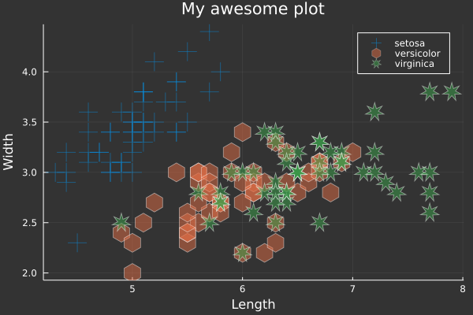

<style>


body{
  line-height: 17px;
  font-size: justify;
  font-family: Outfit;

}

.comment{

  margin:20px;
  padding: 30px;
  width:justify;
  font-color:black;
}

p1{
color:#134b5f;
}

p2{

  width:justify;
  color:black;
  float:left;
  
}

</style>

<div class="comment">
This quote is from the developers of Julia :

—Jeff Bezanson, <br>
-Stefan Karpinski,<br> 
-Viral Shah <i>and</i> <br>
-Alan Edelman<br>
"We are greedy: we want more".<br>
<p>
"We want a language that's open source, with a liberal license. We want the
speed of C with the dynamism of Ruby. We want a language that's
homo-iconic, with true macros like Lisp, but with obvious, familiar
mathematical notation like Matlab. We want something as usable for
general programming as Python, as easy for statistics as R, as natural for
string processing as Perl, as powerful for linear algebra as Matlab, as good
at gluing programs together as the shell. Something that is dirt simple to
learn, yet keeps the most serious hackers happy. We want it interactive
and we want it compiled.<br>

(<p1>Did we mention it should be as fast as C?</p1>)"</p> 

The above quote comes from<u>[this article](https://julialang.org/blog/2012/02/why-we-created-julia/)</u>

</div>

<p2>

Julia is a rich programming language that has a lot to offer, besides the speed and mathematical proficiency, Julia also does pretty well as far a graphing and plotting is concerned.


Take a look ...

Julia also has the capability of using R data sets - the famous R iris data set.

```julia
# load a dataset
using RDatasets
iris = dataset("datasets", "iris");

# load the StatsPlots recipes (for DataFrames) available via:
# Pkg.add("StatsPlots")
using StatsPlots

# Scatter plot with some custom settings
@df iris scatter(
    :SepalLength,
    :SepalWidth,
    group = :Species,
    title = "My awesome plot",
    xlabel = "Length",
    ylabel = "Width",
    m = (0.5, [:cross :hex :star7], 12),
    bg = RGB(0.2, 0.2, 0.2)
)
```


    

    


```julia

```