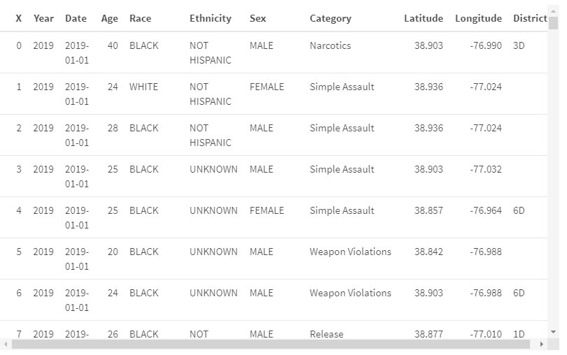
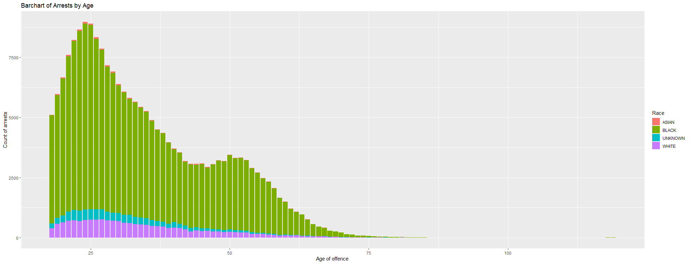
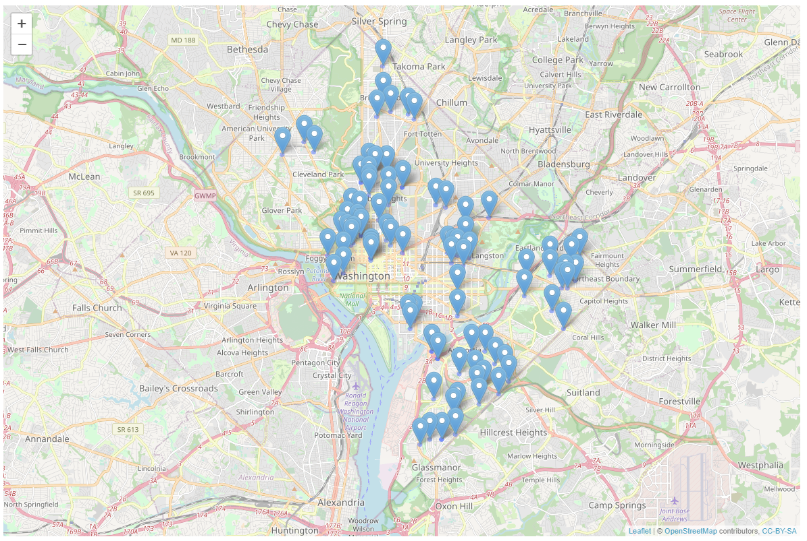
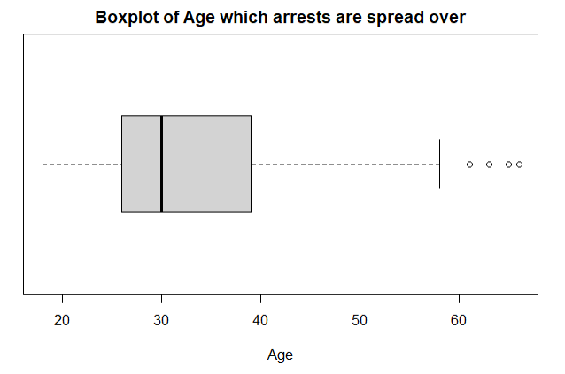
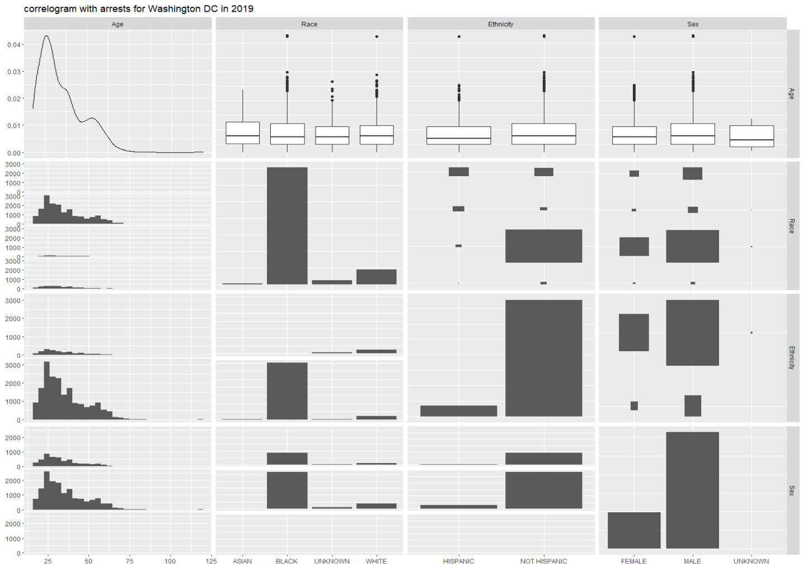

<html>
<body>
<style>

body{
  font-family: Outfit;
  font-size:17px;
  background: #B7e3f3;
}

.img{
border-radius: 8px;

}


</style>

```
knitr::opts_chunk$set(echo = FALSE , warning = FALSE , message = FALSE)
library(tidyverse)
library(ggfortify)
library(kableExtra)
library(leaflet)
library(GGally)
```
<u><h3>Read data into a dataframe</h3></u>

```
arrests <- read.table("https://raw.githubusercontent.com/NicJC/Datasets/main/Arrests.csv", 
                  header = TRUE,
                 sep = ",")
```


```
df<-head(arrests,200)

kable(df) %>%
  kable_styling(full_width = F)
```


```
ggplot(arrests, aes(Age, fill = Race)) + 
geom_bar() +
labs(
    x = "Age of offence",
    y = "Count of arrests",
    title = "Barchart of Arrests by Age"
  ) 
```



```
df<-head(arrests,100)

map = leaflet(df)%>%
  addTiles() %>%
  addCircles(lng = ~Longitude, lat = ~Latitude, popup = ~as.character(Category), label = ~as.character(Category))%>%
  
  addMarkers(lng = ~Longitude, lat = ~Latitude, popup = ~as.character(Category), label = ~as.character(Category))

map

```



<u><h3>Map of 100 arrests in the Washington area</h3></u>

```
df<-head(arrests,100)

boxplot(df$Age,horizontal = T, xlab = "Age", main="Boxplot of 100 arrests showing the Age which arrests are spread over")
```




<u><h3>Re-arrange and sort some data</h3></u>

```
df<- arrests[ which(arrests$Year == "2019" & arrests$Ethnicity != "UNKNOWN"),] 

data <- df[4:7]

ggpairs(data, title="correlogram with arrests for Washington DC in 2019")

```



</body>
