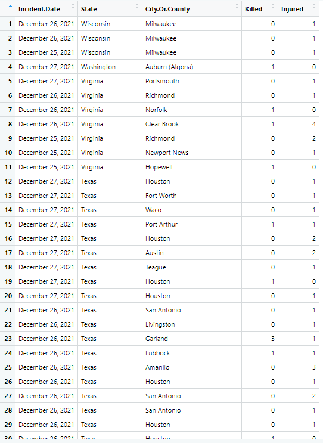

<html>
<body>
<style>

body{
  font-family: Outfit;
  font-size:17px;
  background: #B7e3f3;
}

</style>

## There are several ways of manipulating data in R, The Dplyr package from the tidyverse makes this quite easy.

```
knitr::opts_chunk$set(echo = TRUE)
library(tidyverse)
library(patchwork)
library(broom)
library(kableExtra)
```

```
gun<-read_csv("https://raw.githubusercontent.com/NicJC/Gun-Violence/main/gun.csv")
head(gun)
```
### First 'select' the fields that you want to display

```
gun %>%
  select("Incident.Date" , "State" , "City.Or.County" , "Killed" , "Injured")
```
### Then we filter the selection to not include "New York"

```
gun %>%
  select("Incident.Date" , "State" , "City.Or.County" , "Killed" , "Injured") %>%
  filter(State != "New York")
```
### Then we arrange the data by State descending

```
gun %>%
  select("Incident.Date" , "State" , "City.Or.County" , "Killed" , "Injured") %>%
  filter(State != "New York") %>%
  arrange(desc(State),"Incident.Date")
```


```
R<-gun %>%
  select("Incident.Date" , "State" , "City.Or.County" , "Killed" , "Injured") %>%
  filter(State != "New York") %>%
  arrange(desc(State),"Incident.Date") %>%
  group_by(City.Or.County)

```

```
View(R)
```

### We can View the object R which had the data-manipulation saved to it.

### The group_by adds a count to the the data table, which produces a count of fatalities.

{width=100%}
