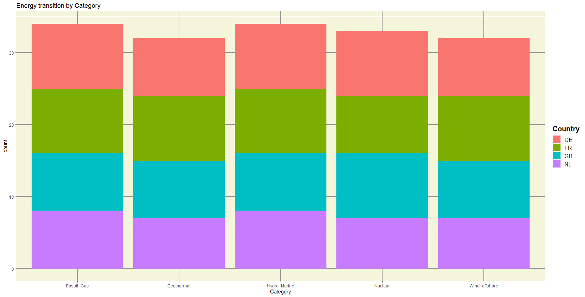
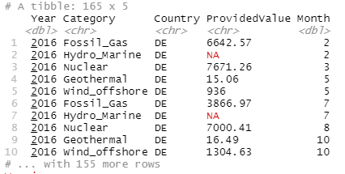
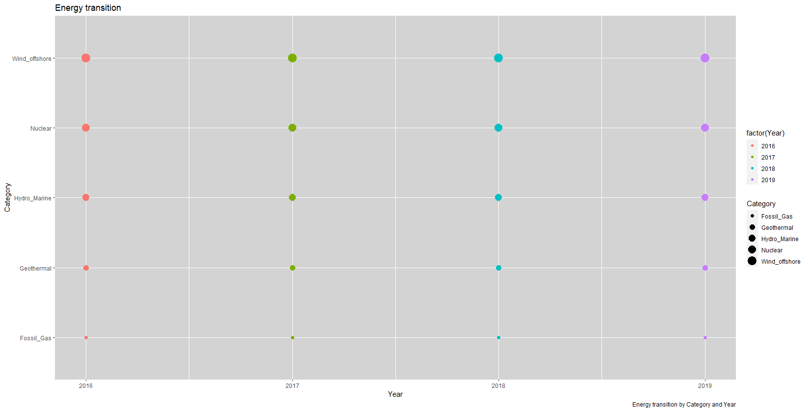
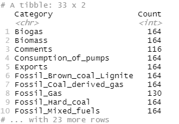
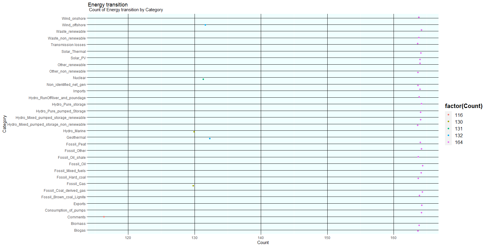
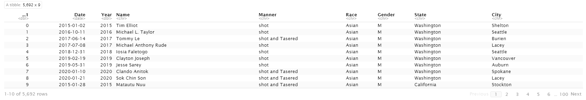
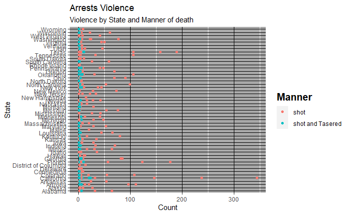
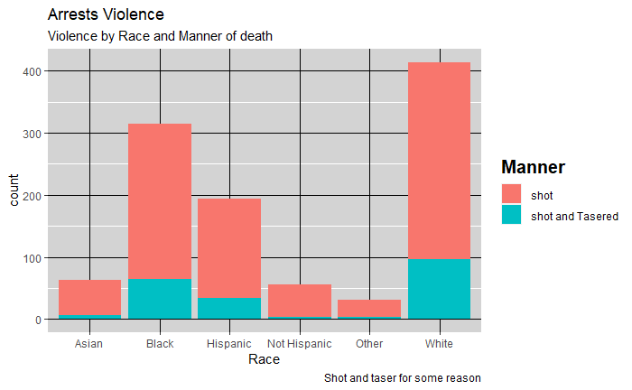
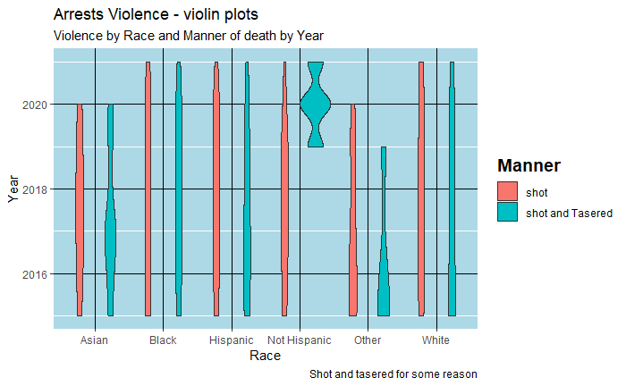

<html>
<body>
<style>


body{
  font-family: Outfit;
  font-size:17px;
  background: #B7e3f3;
}


</style>

### Load R libraries:

```
knitr::opts_chunk$set(echo = TRUE,warning = F , comment = F)
library(tidyverse)
library(patchwork)
library(broom)
library(gridExtra)
library(cowplot)
```
<hr>

### Get data

```
energy<-read_csv("https://raw.githubusercontent.com/NicJC/Energy_transition/master/EnergyTransition.csv")
```

<hr>

### dplyr to manipulate data and to pipe to ggplot:

```
energy %>%
  select( Year , Category , Country , ProvidedValue , Month) %>%
  filter(Category ==  c("Fossil_Gas", "Geothermal" , "Nuclear" , "Wind_offshore","Hydro_Marine")) %>%
  ggplot()  +
  geom_bar(
    aes(x=Category,fill = Country ,size = Year)) + labs(title = "Energy transition by Category") + theme(
  legend.text = element_text(size = 12),
  legend.title = element_text(size = 15, face = "bold"),
  panel.grid.major = element_line(color = "gray60", size = 0.8),
  panel.background = element_rect(fill = "beige")
)
```
## BarPlot




<hr>


```
energy %>%
  select( Year , Category , Country , ProvidedValue , Month) %>%
  filter(Category ==  c("Fossil_Gas", "Geothermal" , "Nuclear" , "Wind_offshore","Hydro_Marine"))
```
<hr>

### The data frame from the above operation




<hr>

```
energy %>%
  select( Year , Category , Country , ProvidedValue , Month) %>%
  filter(Category ==  c("Fossil_Gas", "Geothermal" , "Nuclear" , "Wind_offshore","Hydro_Marine"))%>%
ggplot() + geom_point(
  aes(
    x = Year , y = Category , color = factor(Year),size = Category ))+ 
    labs(title = "Energy transition",caption = "Energy transition by Category and Year") + 
    theme(panel.background = element_rect(fill = "lightgray")) 
```
<hr>




<hr>

```
energy %>%
  select( Year , Category , Country , ProvidedValue , Month) %>%
  filter(Category !=  c("Fossil_Gas", "Geothermal" , "Nuclear" , "Wind_offshore","Hydro_Marine")) %>% 
  group_by(Category)%>% 
  summarise(Count = n()) %>%
  ggplot() + geom_jitter(aes(y = Category , x = Count , color  = factor(Count))) + 
  labs(title = "Energy transition", subtitle = " Count of Energy transition by Category")+ theme(
  legend.text = element_text(size = 12),
  legend.title = element_text(size = 15, face = "bold"),
  panel.grid.major = element_line(color = "black", size = 0.5),
  panel.background = element_rect(fill = "azure") ,
    plot.title = element_text(margin = margin())
)
```
<hr>



<hr>

### The data frame from the below JitterPlot.

<hr>



<hr>

```
url = 'https://raw.githubusercontent.com/NicJC/Datasets/main/Police.csv'

data<-read_csv(url)

```

<hr>

### Rename a field

```
data <- rename(data,Manner = 'Manner of Death')
data
```



<hr>

```
data  %>% 
  select(Date,Year,Race,State,City,Manner) %>%
  arrange(desc(State)) %>%
  filter(State == c("Florida","California", "Texas")) %>%
  group_by(State , Race) %>% 
  summarise(Count = n()) %>%
  ggplot() + geom_point(aes(y=State, x = Count , color = Race , size = State)) + facet_grid(Race ~ State) +
  labs(title = "Arrests Violence",caption = "Violence by State and Race") + 
  theme(panel.background = element_rect(fill = "azure"),
  legend.title = element_text(size = 15, face = "bold"),
  panel.grid.major = element_line(color = "black", size = 0.5)) 
```
<hr>


<hr>


```
data %>% select(Date,Year,Race,State, Manner) %>%
  arrange(desc(Date)) %>%
  #filter(Manner == shot) %>%
  group_by(State , Race, Manner) %>% 
  summarise(Count = n()) %>%
  ggplot() + geom_point(aes(y = State, x = Count, color = Manner)) +
  
  labs(title = "Arrests Violence",subtitle = "Violence by State and Manner of death") + 
  theme(panel.background = element_rect(fill = "darkgray"),
  legend.title = element_text(size = 15, face = "bold"),
  panel.grid.major = element_line(color = "black", size = 0.2)) 
```

<hr>



<hr>

```

data %>% select(Date,Year,Race,State, Manner,Gender,City) %>%
  arrange(desc(City)) %>%
  group_by(State , Race,Gender,City,Year) %>% 
  summarise(Count = n()) %>%
  ggplot() + geom_jitter(aes(x = Gender, y = Count, color = factor(Year))) +facet_grid(Year ~ Race) +
  #ggplot() + geom_bar(aes(x=Race, fill = Manner )) +
  
  
  labs(title = "Arrests Violence",subtitle = "Violence by Race and Gender") + 
  theme(panel.background = element_rect(fill = "azure"),
  legend.title = element_text(size = 15),
  panel.grid.major = element_line(color = "black", size = 0.2))
```

<hr>


<hr>

```
data %>% select(Date,Year,Race,State, Manner) %>%
  arrange(desc(Date))%>%
   group_by(State , Race, Manner, Year) %>% 
  summarise(Count = n()) %>%
  #ggplot() + geom_line(aes(y = State, x = Count, color = Manner))
  ggplot() + geom_bar(aes(x=Race, fill = Manner )) +
  
  labs(title = "Arrests Violence",subtitle = "Violence by Race and Manner of death",caption = "Shot and tasered") + 
  theme(panel.background = element_rect(fill = "lightgray"),
  legend.title = element_text(size = 15, face = "bold"),
  panel.grid.major = element_line(color = "black", size = 0.2))
```

<hr>



<hr>

```
data %>% select(Date,Year,Race,State, Manner) %>%
  arrange(desc(Date))%>%
   group_by(State , Race, Manner, Year) %>% 
  summarise(Count = n()) %>%
 ggplot() + geom_violin(aes(x=Race,y=Year , fill = Manner))+
  
  labs(title = "Arrests Violence - violin plots",subtitle = "Violence by Race and Manner of death by Year",caption = "Shot and tasered") + 
  theme(panel.background = element_rect(fill = "lightblue"),
  legend.title = element_text(size = 14, face = "bold"),
  panel.grid.major = element_line(color = "black", size = 0.2))
```

<hr>




<hr>
