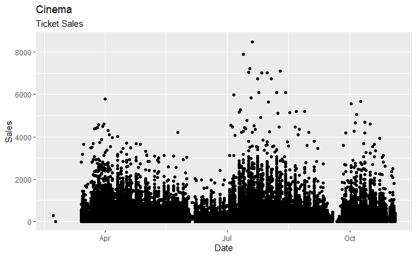

Time Series analysis really interests me, and I've been involved in a lot of forecasting, demand planning and developing of forecasting models.
I've use regression analysis and also ARIMA modeling. 

A time series is a random process where observations are made at times points, t = 0,±1,±2, · · · . and is simply a sequence of random variables indexed by time. 
In practice, the series is usually observed at time points t = 1, 2, · · · .

```r
knitr::opts_chunk$set(message = FALSE)
library(tidyverse)
```

```r

cinema_sales <- read_csv("C:/Data/cinema_sales.csv")

data<-data.frame(x<-cinema_sales$gregor_date,y<-cinema_sales$tickets_sold)
Date<-data$x....cinema_sales.gregor_date
Sales<-data$y....cinema_sales.tickets_sold

ggplot(data,aes(x=Date,y=Sales))+geom_point()+ggtitle('Cinema',subtitle = 'Ticket Sales')


```



