# Linear Regression Using the Least Squares method


```julia
using DataFrames;
using CSV;
using Statistics;
using GLM;
```

## We add some data to a dateframe:


```julia
data = DataFrame(X=[1,2,3,4,5,6,7,8], Y=[2,4,3,6,5,7,6,8])
```


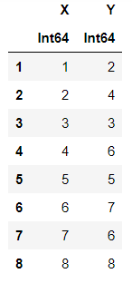


## We add a plot to see what the data looks like


```julia
using Gadfly
p = plot(data, x=:X, y=:Y, Geom.point,color=:X);
```


```julia
p
```


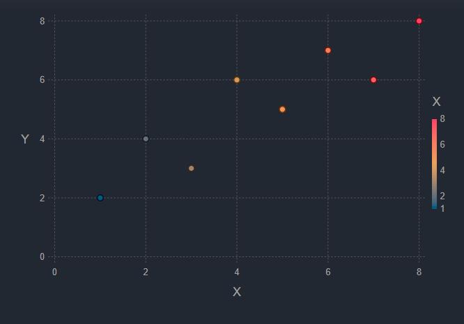


```julia
using GLM
line = lm(@formula(Y ~ X), data)
```


    
    Y ~ 1 + X
    
    Coefficients:
    ─────────────────────────────────────────────────────────────────────
                 Coef.  Std. Error     t  Pr(>|t|)   Lower 95%  Upper 95%
    ─────────────────────────────────────────────────────────────────────
    (Intercept)   1.75    0.728869  2.40    0.0532  -0.0334782    3.53348
    X             0.75    0.144338  5.20    0.0020   0.396819     1.10318
    ─────────────────────────────────────────────────────────────────────


# The best fitted line has the following y values:


```julia
Fittedline = predict(line)
```


    8-element Array{Float64,1}:
    
     2.4999999999999973
     3.249999999999998
     3.9999999999999982
     4.749999999999999
     5.5
     6.25
     7.000000000000001
     7.750000000000002


```julia
x = 1:8
```


    1:8


```julia
y=[2,4,3,6,5,7,6,8]
```


    8-element Array{Int64,1}:
    
     2
     4
     3
     6
     5
     7
     6
     8


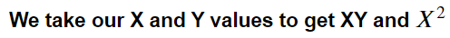


```julia
data = DataFrame(X=[1,2,3,4,5,6,7,8], Y=[2,4,3,6,5,7,6,8],XY=[2,8,9,24,25,42,42,64],Xsqrd = [1,4,9,16,25,36,49,64])
```


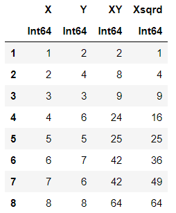


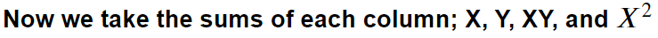


```julia
SumX=sum([1,2,3,4,5,6,7,8])
```


    36


```julia
SumY=sum([2,4,3,6,5,7,6,8])
```


    41


```julia
SumXY=sum([2,8,9,24,25,42,42,64])
```


    216


```julia
SumXsqrd = sum([1,4,9,16,25,36,49,64])
```


    204


## From summing each column, we have the following sums:

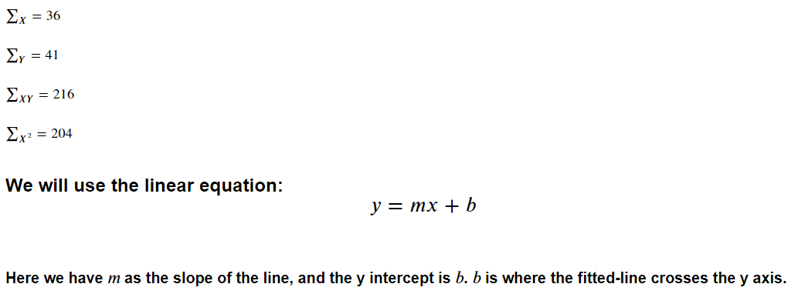

```julia
q = plot(x=1:8, y=Fittedline, Geom.point, Geom.line, Guide.title("Plotting a fitted line"))
```


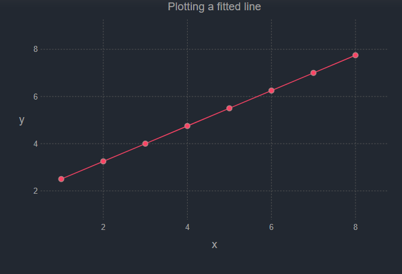


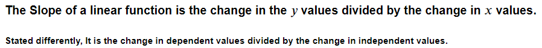


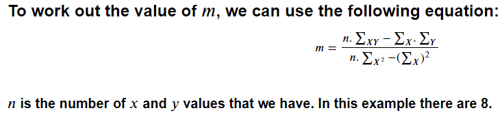


```julia
n=8
```


    8


### We can simply substituted the summing of the columns which was done previously, into the formula to come up with the slope.


```julia
m = (n * SumXY - (SumX * SumY)) / ((n * SumXsqrd) - (SumX)^2)
```


    0.75


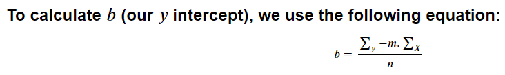

```julia
b = (SumY - (m * SumX))/n
```


    1.75


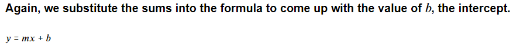


```julia
y1= m * 1 + b;
y2= m * 2 + b;
```


```julia
print(y1);
print(y2);
```

    2.5 3.25

## We can plug the variables into the linear equation


```julia
for i = 1:n
    y = (m * i) + b
    println(y)
  i += 1 
end
```

    2.5
    3.25
    4.0
    4.75
    5.5
    6.25
    7.0
    7.75
    


```julia
Fittedline
```


    8-element Array{Float64,1}:
    
     2.4999999999999973
     3.249999999999998
     3.9999999999999982
     4.749999999999999
     5.5
     6.25
     7.000000000000001
     7.750000000000002


## The numbers match very closely!


```julia
Gadfly.push_theme(:dark)

plot(data, x=:X, y=:Y, Geom.point,intercept=[b], slope=[m], Geom.abline(color="red"),
    color="Y", dark_panel, Guide.title("Plot points with fitted line"))

```


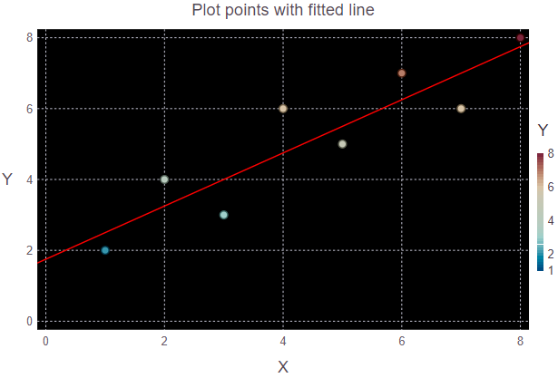


## We have the plotted data points as well as the least squares regression line.
### The computer program works out exactly what we are able to work out with the linear equations!


