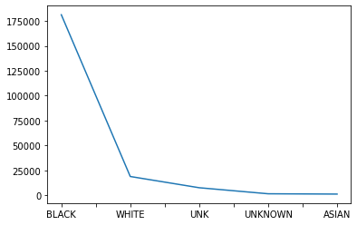
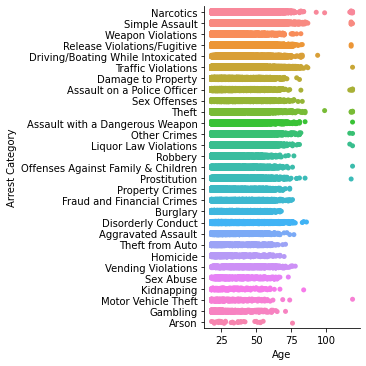
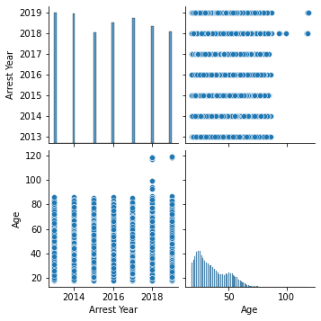

Looking at the amount of people getting arrested over the years, it seems ...


```python
import pandas as pd
import numpy as np
import matplotlib.pyplot as plt
import seaborn as sns
import requests
from io import StringIO
```


```python
url = 'https://mpdc.dc.gov/sites/default/files/dc/sites/mpdc/publication/attachments/Arrests%20by%20Year%2C%202019.csv'
req = requests.get(url)
data = StringIO(req.text)
arrests2019=pd.read_csv(data)
arrests2019.head()
```


<div>
<style scoped>
    .dataframe tbody tr th:only-of-type {
        vertical-align: middle;
    }

    .dataframe tbody tr th {
        vertical-align: top;
    }

    .dataframe thead th {
        text-align: right;
    }
</style>
<table border="1" class="dataframe">
  <thead>
    <tr style="text-align: right;">
      <th></th>
      <th>Arrestee Type</th>
      <th>Arrest Year</th>
      <th>Arrest Date</th>
      <th>Arrest Hour</th>
      <th>CCN</th>
      <th>Arrest Number#</th>
      <th>Age</th>
      <th>Defendant PSA</th>
      <th>Defendant District</th>
      <th>Defendant Race</th>
      <th>...</th>
      <th>Arrest Block GEOX</th>
      <th>Arrest Block GEOY</th>
      <th>Arrest Latitude</th>
      <th>Arrest Longitude</th>
      <th>Offense Location PSA</th>
      <th>Offense Location District</th>
      <th>Offense Block GEOX</th>
      <th>Offense Block GEOY</th>
      <th>Offense Latitude</th>
      <th>Offense Longitude</th>
    </tr>
  </thead>
  <tbody>
    <tr>
      <th>0</th>
      <td>Adult Arrest</td>
      <td>2019</td>
      <td>1/1/2019</td>
      <td>1</td>
      <td>72acd30aeca87cbfea207e41b9227179ff02ccee3e8f6c...</td>
      <td>7e867467e94b734583a1611e4c28dc8a267a2d0a5dee7b...</td>
      <td>40</td>
      <td>306.0</td>
      <td>3D</td>
      <td>BLACK</td>
      <td>...</td>
      <td>400900.0</td>
      <td>137200.0</td>
      <td>38.903</td>
      <td>-76.990</td>
      <td>506</td>
      <td>5D</td>
      <td>400900.0</td>
      <td>137200.0</td>
      <td>38.903</td>
      <td>-76.990</td>
    </tr>
    <tr>
      <th>1</th>
      <td>Adult Arrest</td>
      <td>2019</td>
      <td>1/1/2019</td>
      <td>1</td>
      <td>13eb875a2ab914c2724549ebc8cb93a71e5354099bb6e4...</td>
      <td>50bf8f37bbef4ec6d5cb99a84d90045ad18db977bdd3d1...</td>
      <td>24</td>
      <td>NaN</td>
      <td>NaN</td>
      <td>WHITE</td>
      <td>...</td>
      <td>397900.0</td>
      <td>140900.0</td>
      <td>38.936</td>
      <td>-77.024</td>
      <td>409</td>
      <td>4D</td>
      <td>397900.0</td>
      <td>140900.0</td>
      <td>38.936</td>
      <td>-77.024</td>
    </tr>
    <tr>
      <th>2</th>
      <td>Adult Arrest</td>
      <td>2019</td>
      <td>1/1/2019</td>
      <td>1</td>
      <td>13eb875a2ab914c2724549ebc8cb93a71e5354099bb6e4...</td>
      <td>bc33e59a7dde61bddeb412cdab2f509806502bbf8cdd1f...</td>
      <td>28</td>
      <td>NaN</td>
      <td>NaN</td>
      <td>BLACK</td>
      <td>...</td>
      <td>397900.0</td>
      <td>140900.0</td>
      <td>38.936</td>
      <td>-77.024</td>
      <td>409</td>
      <td>4D</td>
      <td>397900.0</td>
      <td>140900.0</td>
      <td>38.936</td>
      <td>-77.024</td>
    </tr>
    <tr>
      <th>3</th>
      <td>Adult Arrest</td>
      <td>2019</td>
      <td>1/1/2019</td>
      <td>1</td>
      <td>5a26484e3f8344a6095ef75e08bc5f4bb2a51c5eef195c...</td>
      <td>bf7f2dcd93d588e17ad2f3e97855cafc73386a7cbfffe3...</td>
      <td>25</td>
      <td>NaN</td>
      <td>NaN</td>
      <td>BLACK</td>
      <td>...</td>
      <td>397300.0</td>
      <td>137300.0</td>
      <td>38.903</td>
      <td>-77.032</td>
      <td>209</td>
      <td>2D</td>
      <td>397300.0</td>
      <td>137300.0</td>
      <td>38.903</td>
      <td>-77.032</td>
    </tr>
    <tr>
      <th>4</th>
      <td>Adult Arrest</td>
      <td>2019</td>
      <td>1/1/2019</td>
      <td>1</td>
      <td>3f42ab713fe00e08e2582bd419d6ee655e60b6ca8630a7...</td>
      <td>3628f4697958df4162cec4007e8ec0102b8b412357e847...</td>
      <td>25</td>
      <td>606.0</td>
      <td>6D</td>
      <td>BLACK</td>
      <td>...</td>
      <td>403100.0</td>
      <td>132100.0</td>
      <td>38.857</td>
      <td>-76.964</td>
      <td>606</td>
      <td>6D</td>
      <td>403100.0</td>
      <td>132100.0</td>
      <td>38.857</td>
      <td>-76.964</td>
    </tr>
  </tbody>
</table>
<p>5 rows × 26 columns</p>
</div>


```python
url1 = 'https://mpdc.dc.gov/sites/default/files/dc/sites/mpdc/publication/attachments/Arrests%20by%20Year%2C%202018.csv'
req1 = requests.get(url1)
data1 = StringIO(req1.text)
arrests2018=pd.read_csv(data1)
arrests2018.head()
```


<div>
<style scoped>
    .dataframe tbody tr th:only-of-type {
        vertical-align: middle;
    }

    .dataframe tbody tr th {
        vertical-align: top;
    }

    .dataframe thead th {
        text-align: right;
    }
</style>
<table border="1" class="dataframe">
  <thead>
    <tr style="text-align: right;">
      <th></th>
      <th>Arrestee Type</th>
      <th>Arrest Year</th>
      <th>Arrest Date</th>
      <th>Arrest Hour</th>
      <th>CCN</th>
      <th>Arrest Number#</th>
      <th>Age</th>
      <th>Defendant PSA</th>
      <th>Defendant District</th>
      <th>Defendant Race</th>
      <th>...</th>
      <th>Arrest Block GEOX</th>
      <th>Arrest Block GEOY</th>
      <th>Arrest Latitude</th>
      <th>Arrest Longitude</th>
      <th>Offense Location PSA</th>
      <th>Offense Location District</th>
      <th>Offense Block GEOX</th>
      <th>Offense Block GEOY</th>
      <th>Offense Latitude</th>
      <th>Offense Longitude</th>
    </tr>
  </thead>
  <tbody>
    <tr>
      <th>0</th>
      <td>Adult Arrest</td>
      <td>2018</td>
      <td>1/1/2018</td>
      <td>0</td>
      <td>45e4226425e80d02539a94ac87200dc60e63c7f6548cea...</td>
      <td>d34d69f6a9f02b240867d2411137a720e03e9f5d71053c...</td>
      <td>21</td>
      <td>505.0</td>
      <td>5D</td>
      <td>BLACK</td>
      <td>...</td>
      <td>402300.0</td>
      <td>132200.0</td>
      <td>38.858</td>
      <td>-76.973</td>
      <td>702</td>
      <td>7D</td>
      <td>402300.0</td>
      <td>132200.0</td>
      <td>38.858</td>
      <td>-76.973</td>
    </tr>
    <tr>
      <th>1</th>
      <td>Adult Arrest</td>
      <td>2018</td>
      <td>1/1/2018</td>
      <td>0</td>
      <td>70296d91144c74e85ab383a3c4dc2afa0da2aa67d9b73e...</td>
      <td>e0efb619fec98ed22419c18dce3182ba3f20e83f4addcb...</td>
      <td>39</td>
      <td>NaN</td>
      <td>NaN</td>
      <td>BLACK</td>
      <td>...</td>
      <td>407600.0</td>
      <td>136100.0</td>
      <td>38.893</td>
      <td>-76.912</td>
      <td>608</td>
      <td>6D</td>
      <td>407600.0</td>
      <td>136100.0</td>
      <td>38.893</td>
      <td>-76.912</td>
    </tr>
    <tr>
      <th>2</th>
      <td>Adult Arrest</td>
      <td>2018</td>
      <td>1/1/2018</td>
      <td>0</td>
      <td>05ac6e1c5275575f069a5d07587e13ad37e51830935280...</td>
      <td>fff3b1e9860cb68c958aef74b05f34fbde5a34bfdd4f53...</td>
      <td>30</td>
      <td>NaN</td>
      <td>NaN</td>
      <td>WHITE</td>
      <td>...</td>
      <td>399400.0</td>
      <td>137400.0</td>
      <td>38.905</td>
      <td>-77.007</td>
      <td>102</td>
      <td>1D</td>
      <td>399200.0</td>
      <td>137500.0</td>
      <td>38.905</td>
      <td>-77.009</td>
    </tr>
    <tr>
      <th>3</th>
      <td>Adult Arrest</td>
      <td>2018</td>
      <td>1/1/2018</td>
      <td>0</td>
      <td>9117977dd9c291ec2936dcd8a90ff6c0147b43798790a7...</td>
      <td>a6582fb081deecafc53539088c48342e9dea64d71ae07c...</td>
      <td>37</td>
      <td>302.0</td>
      <td>3D</td>
      <td>BLACK</td>
      <td>...</td>
      <td>397100.0</td>
      <td>140700.0</td>
      <td>38.935</td>
      <td>-77.033</td>
      <td>408</td>
      <td>4D</td>
      <td>397100.0</td>
      <td>140700.0</td>
      <td>38.935</td>
      <td>-77.033</td>
    </tr>
    <tr>
      <th>4</th>
      <td>Adult Arrest</td>
      <td>2018</td>
      <td>1/1/2018</td>
      <td>0</td>
      <td>3bda032c05f1b35e48eb110a5f9c049f430a18964219fc...</td>
      <td>2c9a5520d142185d7a3e89c882af3623d04de2ce0b9591...</td>
      <td>42</td>
      <td>NaN</td>
      <td>NaN</td>
      <td>BLACK</td>
      <td>...</td>
      <td>402300.0</td>
      <td>131000.0</td>
      <td>38.847</td>
      <td>-76.973</td>
      <td>704</td>
      <td>7D</td>
      <td>402300.0</td>
      <td>131000.0</td>
      <td>38.847</td>
      <td>-76.973</td>
    </tr>
  </tbody>
</table>
<p>5 rows × 26 columns</p>
</div>


```python
url2 = 'https://mpdc.dc.gov/sites/default/files/dc/sites/mpdc/publication/attachments/Arrests%202017%20Public.csv'
req2 = requests.get(url2)
data2 = StringIO(req2.text)
arrests2017=pd.read_csv(data2)
arrests2017.head()
```


<div>
<style scoped>
    .dataframe tbody tr th:only-of-type {
        vertical-align: middle;
    }

    .dataframe tbody tr th {
        vertical-align: top;
    }

    .dataframe thead th {
        text-align: right;
    }
</style>
<table border="1" class="dataframe">
  <thead>
    <tr style="text-align: right;">
      <th></th>
      <th>Arrestee Type</th>
      <th>Arrest Year</th>
      <th>Arrest Date</th>
      <th>Arrest Hour</th>
      <th>CCN</th>
      <th>Arrest Number#</th>
      <th>Age</th>
      <th>Defendant PSA</th>
      <th>Defendant District</th>
      <th>Defendant Race</th>
      <th>...</th>
      <th>Arrest Location Block GeoX</th>
      <th>Arrest Location Block GeoY</th>
      <th>Offense GEOY</th>
      <th>Offense GEOX</th>
      <th>Offense PSA</th>
      <th>Offense District</th>
      <th>Arrest Latitude</th>
      <th>Arrest Longitude</th>
      <th>Offense Latitude</th>
      <th>Offense Longitude</th>
    </tr>
  </thead>
  <tbody>
    <tr>
      <th>0</th>
      <td>Adult Arrest</td>
      <td>2017</td>
      <td>2017-01-01</td>
      <td>0</td>
      <td>ce59610afe457aecbcb46ca03d58647acfcae066c2a628...</td>
      <td>de1b8363cba622e5aca1967bcd9aa36235013a7fa731fd...</td>
      <td>25</td>
      <td>106</td>
      <td>1D</td>
      <td>BLACK</td>
      <td>...</td>
      <td>398500</td>
      <td>138500</td>
      <td>138500.0</td>
      <td>398500.0</td>
      <td>306</td>
      <td>3D</td>
      <td>38.9144</td>
      <td>-77.0173</td>
      <td>38.9144</td>
      <td>-77.0173</td>
    </tr>
    <tr>
      <th>1</th>
      <td>Adult Arrest</td>
      <td>2017</td>
      <td>2017-01-01</td>
      <td>0</td>
      <td>bbe582834bb54bd2a5252eca11a342d246662438c35f89...</td>
      <td>9396ae868048aea46238573e1f33082576a851ded798e9...</td>
      <td>40</td>
      <td>304</td>
      <td>3D</td>
      <td>WHITE</td>
      <td>...</td>
      <td>397000</td>
      <td>139700</td>
      <td>139700.0</td>
      <td>397000.0</td>
      <td>304</td>
      <td>3D</td>
      <td>38.9252</td>
      <td>-77.0346</td>
      <td>38.9252</td>
      <td>-77.0346</td>
    </tr>
    <tr>
      <th>2</th>
      <td>Adult Arrest</td>
      <td>2017</td>
      <td>2017-01-01</td>
      <td>0</td>
      <td>1a6a81a07aaae68a588acaf59ddcedb6177a97a7a742cd...</td>
      <td>7992f9917b90d89eae61933c2941c3b947dd28f4e6b7ca...</td>
      <td>27</td>
      <td>Out of State</td>
      <td>Out of State</td>
      <td>BLACK</td>
      <td>...</td>
      <td>397200</td>
      <td>138800</td>
      <td>138800.0</td>
      <td>397200.0</td>
      <td>305</td>
      <td>3D</td>
      <td>38.9171</td>
      <td>-77.0323</td>
      <td>38.9171</td>
      <td>-77.0323</td>
    </tr>
    <tr>
      <th>3</th>
      <td>Adult Arrest</td>
      <td>2017</td>
      <td>2017-01-01</td>
      <td>0</td>
      <td>bbe582834bb54bd2a5252eca11a342d246662438c35f89...</td>
      <td>c268255432948733d2a13e41dda8c2cb75cb383c7b3af1...</td>
      <td>24</td>
      <td>304</td>
      <td>3D</td>
      <td>WHITE</td>
      <td>...</td>
      <td>397000</td>
      <td>139700</td>
      <td>139700.0</td>
      <td>397000.0</td>
      <td>304</td>
      <td>3D</td>
      <td>38.9252</td>
      <td>-77.0346</td>
      <td>38.9252</td>
      <td>-77.0346</td>
    </tr>
    <tr>
      <th>4</th>
      <td>Adult Arrest</td>
      <td>2017</td>
      <td>2017-01-01</td>
      <td>0</td>
      <td>bbe582834bb54bd2a5252eca11a342d246662438c35f89...</td>
      <td>605bd9c76761055299d76e054561bf7c8beac61f64b65a...</td>
      <td>30</td>
      <td>304</td>
      <td>3D</td>
      <td>WHITE</td>
      <td>...</td>
      <td>397000</td>
      <td>139700</td>
      <td>139700.0</td>
      <td>397000.0</td>
      <td>304</td>
      <td>3D</td>
      <td>38.9252</td>
      <td>-77.0346</td>
      <td>38.9252</td>
      <td>-77.0346</td>
    </tr>
  </tbody>
</table>
<p>5 rows × 26 columns</p>
</div>


```python
url3 = 'https://mpdc.dc.gov/sites/default/files/dc/sites/mpdc/publication/attachments/Arrests%202016%20Public.csv'
req3 = requests.get(url3)
data3 = StringIO(req3.text)
arrests2016=pd.read_csv(data3)
arrests2016.head()
```


<div>
<style scoped>
    .dataframe tbody tr th:only-of-type {
        vertical-align: middle;
    }

    .dataframe tbody tr th {
        vertical-align: top;
    }

    .dataframe thead th {
        text-align: right;
    }
</style>
<table border="1" class="dataframe">
  <thead>
    <tr style="text-align: right;">
      <th></th>
      <th>Arrestee Type</th>
      <th>Arrest Year</th>
      <th>Arrest Date</th>
      <th>Arrest Hour</th>
      <th>CCN</th>
      <th>Arrest Number#</th>
      <th>Age</th>
      <th>Defendant PSA</th>
      <th>Defendant District</th>
      <th>Defendant Race</th>
      <th>...</th>
      <th>Arrest Location Block GeoX</th>
      <th>Arrest Location Block GeoY</th>
      <th>Offense GEOY</th>
      <th>Offense GEOX</th>
      <th>Offense PSA</th>
      <th>Offense District</th>
      <th>Arrest Latitude</th>
      <th>Arrest Longitude</th>
      <th>Offense Latitude</th>
      <th>Offense Longitude</th>
    </tr>
  </thead>
  <tbody>
    <tr>
      <th>0</th>
      <td>Adult Arrest</td>
      <td>2016</td>
      <td>2016-01-01</td>
      <td>0</td>
      <td>b9b62d32861f7e648060d6359262390f7fe509f0dd32d3...</td>
      <td>deb27f1b1bf3f07a10276f534f70e07c27ee15118ced17...</td>
      <td>39</td>
      <td>Out of State</td>
      <td>Out of State</td>
      <td>WHITE</td>
      <td>...</td>
      <td>395700</td>
      <td>137400</td>
      <td>137400.0</td>
      <td>395700.0</td>
      <td>207</td>
      <td>2D</td>
      <td>38.9044</td>
      <td>-77.0496</td>
      <td>38.9044</td>
      <td>-77.0496</td>
    </tr>
    <tr>
      <th>1</th>
      <td>Adult Arrest</td>
      <td>2016</td>
      <td>2016-01-01</td>
      <td>0</td>
      <td>1ce3ecc5036e9d697eb8a72bb967117505569c89c3cd70...</td>
      <td>dc86b4109729437063a3f54d1cba20a942c6aea7eff709...</td>
      <td>27</td>
      <td>Out of State</td>
      <td>Out of State</td>
      <td>WHITE</td>
      <td>...</td>
      <td>396400</td>
      <td>139300</td>
      <td>139300.0</td>
      <td>396400.0</td>
      <td>303</td>
      <td>3D</td>
      <td>38.9216</td>
      <td>-77.0415</td>
      <td>38.9216</td>
      <td>-77.0415</td>
    </tr>
    <tr>
      <th>2</th>
      <td>Adult Arrest</td>
      <td>2016</td>
      <td>2016-01-01</td>
      <td>0</td>
      <td>aabe711cc0ba0c5ba0eddcbdee1d2ad2e17c8115a88b45...</td>
      <td>9bc818ad64b9baef821570fc34fd54981b2b9f63e2ec60...</td>
      <td>21</td>
      <td>Out of State</td>
      <td>Out of State</td>
      <td>BLACK</td>
      <td>...</td>
      <td>397900</td>
      <td>138700</td>
      <td>138700.0</td>
      <td>397900.0</td>
      <td>305</td>
      <td>3D</td>
      <td>38.9162</td>
      <td>-77.0242</td>
      <td>38.9162</td>
      <td>-77.0242</td>
    </tr>
    <tr>
      <th>3</th>
      <td>Adult Arrest</td>
      <td>2016</td>
      <td>2016-01-01</td>
      <td>0</td>
      <td>8c13af4aa7d95b64714286401710f73d16bde08a5ed7a9...</td>
      <td>decbb3f74664669959abd6b11299e5a3a30397cf79f1a6...</td>
      <td>52</td>
      <td>603</td>
      <td>6D</td>
      <td>BLACK</td>
      <td>...</td>
      <td>405300</td>
      <td>135100</td>
      <td>135100.0</td>
      <td>405300.0</td>
      <td>604</td>
      <td>6D</td>
      <td>38.8837</td>
      <td>-76.9389</td>
      <td>38.8837</td>
      <td>-76.9389</td>
    </tr>
    <tr>
      <th>4</th>
      <td>Adult Arrest</td>
      <td>2016</td>
      <td>2016-01-01</td>
      <td>0</td>
      <td>659f8779436b12c6b5b3353c9774a52d706ff82de70aa5...</td>
      <td>1398909d93d92032e15406e8c7b5febacff591f619ccea...</td>
      <td>33</td>
      <td>703</td>
      <td>7D</td>
      <td>BLACK</td>
      <td>...</td>
      <td>400300</td>
      <td>132400</td>
      <td>132400.0</td>
      <td>400300.0</td>
      <td>703</td>
      <td>7D</td>
      <td>38.8594</td>
      <td>-76.9965</td>
      <td>38.8594</td>
      <td>-76.9965</td>
    </tr>
  </tbody>
</table>
<p>5 rows × 26 columns</p>
</div>


```python
url4 = 'https://mpdc.dc.gov/sites/default/files/dc/sites/mpdc/publication/attachments/Arrests%202015%20Public.csv'
req4 = requests.get(url4)
data4 = StringIO(req4.text)
arrests2015=pd.read_csv(data4)
arrests2015.head()
```


<div>
<style scoped>
    .dataframe tbody tr th:only-of-type {
        vertical-align: middle;
    }

    .dataframe tbody tr th {
        vertical-align: top;
    }

    .dataframe thead th {
        text-align: right;
    }
</style>
<table border="1" class="dataframe">
  <thead>
    <tr style="text-align: right;">
      <th></th>
      <th>Arrestee Type</th>
      <th>Arrest Year</th>
      <th>Arrest Date</th>
      <th>Arrest Hour</th>
      <th>CCN</th>
      <th>Arrest Number#</th>
      <th>Age</th>
      <th>Defendant PSA</th>
      <th>Defendant District</th>
      <th>Defendant Race</th>
      <th>...</th>
      <th>Arrest Location Block GeoX</th>
      <th>Arrest Location Block GeoY</th>
      <th>Offense GEOY</th>
      <th>Offense GEOX</th>
      <th>Offense PSA</th>
      <th>Offense District</th>
      <th>Arrest Latitude</th>
      <th>Arrest Longitude</th>
      <th>Offense Latitude</th>
      <th>Offense Longitude</th>
    </tr>
  </thead>
  <tbody>
    <tr>
      <th>0</th>
      <td>Adult Arrest</td>
      <td>2015</td>
      <td>2015-01-01</td>
      <td>0</td>
      <td>cf6418a4a5b7850eb2f95f53728d849d2313916457997f...</td>
      <td>41fc60e414f3254e644f884cb3e20f493f593e97cf5b29...</td>
      <td>39</td>
      <td>103</td>
      <td>1D</td>
      <td>BLACK</td>
      <td>...</td>
      <td>397300</td>
      <td>138800</td>
      <td>138800.0</td>
      <td>397300.0</td>
      <td>305</td>
      <td>3D</td>
      <td>38.9171</td>
      <td>-77.0311</td>
      <td>38.9171</td>
      <td>-77.0311</td>
    </tr>
    <tr>
      <th>1</th>
      <td>Adult Arrest</td>
      <td>2015</td>
      <td>2015-01-01</td>
      <td>0</td>
      <td>bec371578135f1b530e03bb5ccdb91718a84196890e3c9...</td>
      <td>842587182686f48f46f7bdb4fc12e33421b9ff4e9369f8...</td>
      <td>25</td>
      <td>406</td>
      <td>4D</td>
      <td>BLACK</td>
      <td>...</td>
      <td>397100</td>
      <td>140400</td>
      <td>140400.0</td>
      <td>397100.0</td>
      <td>409</td>
      <td>4D</td>
      <td>38.9315</td>
      <td>-77.0334</td>
      <td>38.9315</td>
      <td>-77.0334</td>
    </tr>
    <tr>
      <th>2</th>
      <td>Adult Arrest</td>
      <td>2015</td>
      <td>2015-01-01</td>
      <td>0</td>
      <td>5ed9f92e9dba419b165224ca523a8e1ae8204709f127a5...</td>
      <td>4fb0b535ee8fe76ba052e0f360d325e24402759fb41ff6...</td>
      <td>33</td>
      <td>506</td>
      <td>5D</td>
      <td>BLACK</td>
      <td>...</td>
      <td>401100</td>
      <td>137600</td>
      <td>137600.0</td>
      <td>401100.0</td>
      <td>506</td>
      <td>5D</td>
      <td>38.9063</td>
      <td>-76.9873</td>
      <td>38.9063</td>
      <td>-76.9873</td>
    </tr>
    <tr>
      <th>3</th>
      <td>Adult Arrest</td>
      <td>2015</td>
      <td>2015-01-01</td>
      <td>0</td>
      <td>8fd6588a9b2df7dd84ec97b9d029adca090720f64c5816...</td>
      <td>7ca6579a3da39a740cc3c837f7d6fcc70712a60bbb5cb4...</td>
      <td>44</td>
      <td>705</td>
      <td>7D</td>
      <td>BLACK</td>
      <td>...</td>
      <td>400500</td>
      <td>130600</td>
      <td>130600.0</td>
      <td>400500.0</td>
      <td>705</td>
      <td>7D</td>
      <td>38.8432</td>
      <td>-76.9942</td>
      <td>38.8432</td>
      <td>-76.9942</td>
    </tr>
    <tr>
      <th>4</th>
      <td>Adult Arrest</td>
      <td>2015</td>
      <td>2015-01-01</td>
      <td>0</td>
      <td>5059d2f762f71ef239e590c82496bbc50f381a72d492a4...</td>
      <td>7849b034676ea187a202c5c2d2db302d2ea1aad9513b70...</td>
      <td>30</td>
      <td>Out of State</td>
      <td>Out of State</td>
      <td>BLACK</td>
      <td>...</td>
      <td>400200</td>
      <td>129300</td>
      <td>129300.0</td>
      <td>400200.0</td>
      <td>706</td>
      <td>7D</td>
      <td>38.8315</td>
      <td>-76.9977</td>
      <td>38.8315</td>
      <td>-76.9977</td>
    </tr>
  </tbody>
</table>
<p>5 rows × 26 columns</p>
</div>


```python
url5 = 'https://mpdc.dc.gov/sites/default/files/dc/sites/mpdc/publication/attachments/Arrests%202014%20Public.csv'
req5 = requests.get(url5)
data5 = StringIO(req5.text)
arrests2014=pd.read_csv(data5)
arrests2014.head()
```


<div>
<style scoped>
    .dataframe tbody tr th:only-of-type {
        vertical-align: middle;
    }

    .dataframe tbody tr th {
        vertical-align: top;
    }

    .dataframe thead th {
        text-align: right;
    }
</style>
<table border="1" class="dataframe">
  <thead>
    <tr style="text-align: right;">
      <th></th>
      <th>Arrestee Type</th>
      <th>Arrest Year</th>
      <th>Arrest Date</th>
      <th>Arrest Hour</th>
      <th>CCN</th>
      <th>Arrest Number#</th>
      <th>Age</th>
      <th>Defendant PSA</th>
      <th>Defendant District</th>
      <th>Defendant Race</th>
      <th>...</th>
      <th>Arrest Location Block GeoX</th>
      <th>Arrest Location Block GeoY</th>
      <th>Offense GEOY</th>
      <th>Offense GEOX</th>
      <th>Offense PSA</th>
      <th>Offense District</th>
      <th>Arrest Latitude</th>
      <th>Arrest Longitude</th>
      <th>Offense Latitude</th>
      <th>Offense Longitude</th>
    </tr>
  </thead>
  <tbody>
    <tr>
      <th>0</th>
      <td>Adult Arrest</td>
      <td>2014</td>
      <td>2014-01-01</td>
      <td>0</td>
      <td>ce24cab1a93ae12f365dba8e5a6de9efc30a6d1b46fef2...</td>
      <td>3040359953f13bc63efe9c74ca390ca325274048770a95...</td>
      <td>29</td>
      <td>707</td>
      <td>7D</td>
      <td>BLACK</td>
      <td>...</td>
      <td>399200</td>
      <td>137700</td>
      <td>137700.0</td>
      <td>399200.0</td>
      <td>501</td>
      <td>5D</td>
      <td>38.9072</td>
      <td>-77.0092</td>
      <td>38.9072</td>
      <td>-77.0092</td>
    </tr>
    <tr>
      <th>1</th>
      <td>Adult Arrest</td>
      <td>2014</td>
      <td>2014-01-01</td>
      <td>0</td>
      <td>9495eab3392e8b9fbec85630f09d95bf9a1f74d9af9bfb...</td>
      <td>0bdeac9d616b6b93246897afc05ad908b589984222e0a2...</td>
      <td>58</td>
      <td>106</td>
      <td>1D</td>
      <td>BLACK</td>
      <td>...</td>
      <td>401300</td>
      <td>134700</td>
      <td>134700.0</td>
      <td>401300.0</td>
      <td>108</td>
      <td>1D</td>
      <td>38.8801</td>
      <td>-76.9850</td>
      <td>38.8801</td>
      <td>-76.9850</td>
    </tr>
    <tr>
      <th>2</th>
      <td>Adult Arrest</td>
      <td>2014</td>
      <td>2014-01-01</td>
      <td>0</td>
      <td>608f69a6d327c23b175f0adc808866359e9bd0154d8f5d...</td>
      <td>bfa6dacc9542189b1bea1491bfba5d7331bfdcbe5c0aed...</td>
      <td>26</td>
      <td>Out of State</td>
      <td>Out of State</td>
      <td>BLACK</td>
      <td>...</td>
      <td>399500</td>
      <td>134300</td>
      <td>134300.0</td>
      <td>398900.0</td>
      <td>105</td>
      <td>1D</td>
      <td>38.8765</td>
      <td>-77.0058</td>
      <td>38.8765</td>
      <td>-77.0127</td>
    </tr>
    <tr>
      <th>3</th>
      <td>Adult Arrest</td>
      <td>2014</td>
      <td>2014-01-01</td>
      <td>0</td>
      <td>03b8df9322d3b24021c74075d20a8cfab9daec00682a13...</td>
      <td>6a7b551b31417e00f1c2f712935743cad1e9b2f80e8883...</td>
      <td>24</td>
      <td>Out of State</td>
      <td>Out of State</td>
      <td>BLACK</td>
      <td>...</td>
      <td>397600</td>
      <td>138800</td>
      <td>138800.0</td>
      <td>397600.0</td>
      <td>305</td>
      <td>3D</td>
      <td>38.9171</td>
      <td>-77.0277</td>
      <td>38.9171</td>
      <td>-77.0277</td>
    </tr>
    <tr>
      <th>4</th>
      <td>Adult Arrest</td>
      <td>2014</td>
      <td>2014-01-01</td>
      <td>0</td>
      <td>ab7cacc2e615878255e8855304fb5de42eb76a2cbb8e85...</td>
      <td>6f2204fb27c58c88ea6f709df9e4d68d505d2ee4ee16a8...</td>
      <td>24</td>
      <td>Out of State</td>
      <td>Out of State</td>
      <td>BLACK</td>
      <td>...</td>
      <td>397400</td>
      <td>138200</td>
      <td>138200.0</td>
      <td>397400.0</td>
      <td>307</td>
      <td>3D</td>
      <td>38.9117</td>
      <td>-77.0300</td>
      <td>38.9117</td>
      <td>-77.0300</td>
    </tr>
  </tbody>
</table>
<p>5 rows × 26 columns</p>
</div>


```python
url6 = 'https://mpdc.dc.gov/sites/default/files/dc/sites/mpdc/publication/attachments/Arrests%202013%20Public.csv'
req6 = requests.get(url6)
data6 = StringIO(req6.text)
arrests2013=pd.read_csv(data6)
arrests2013.head()
```


<div>
<style scoped>
    .dataframe tbody tr th:only-of-type {
        vertical-align: middle;
    }

    .dataframe tbody tr th {
        vertical-align: top;
    }

    .dataframe thead th {
        text-align: right;
    }
</style>
<table border="1" class="dataframe">
  <thead>
    <tr style="text-align: right;">
      <th></th>
      <th>Arrestee Type</th>
      <th>Arrest Year</th>
      <th>Arrest Date</th>
      <th>Arrest Hour</th>
      <th>CCN</th>
      <th>Arrest Number#</th>
      <th>Age</th>
      <th>Defendant PSA</th>
      <th>Defendant District</th>
      <th>Defendant Race</th>
      <th>...</th>
      <th>Arrest Location Block GeoX</th>
      <th>Arrest Location Block GeoY</th>
      <th>Offense GEOY</th>
      <th>Offense GEOX</th>
      <th>Offense PSA</th>
      <th>Offense District</th>
      <th>Arrest Latitude</th>
      <th>Arrest Longitude</th>
      <th>Offense Latitude</th>
      <th>Offense Longitude</th>
    </tr>
  </thead>
  <tbody>
    <tr>
      <th>0</th>
      <td>Adult Arrest</td>
      <td>2013</td>
      <td>2013-01-01</td>
      <td>0</td>
      <td>39e6b5312abaf50cabba5207ce614c8e40425ce8408f55...</td>
      <td>a765a0eb0ce5bbe83326cafff7b61ead522811b2947121...</td>
      <td>21</td>
      <td>Out of State</td>
      <td>Out of State</td>
      <td>WHITE</td>
      <td>...</td>
      <td>396400</td>
      <td>137600</td>
      <td>137600.0</td>
      <td>396400.0</td>
      <td>208</td>
      <td>2D</td>
      <td>38.9063</td>
      <td>-77.0415</td>
      <td>38.9063</td>
      <td>-77.0415</td>
    </tr>
    <tr>
      <th>1</th>
      <td>Adult Arrest</td>
      <td>2013</td>
      <td>2013-01-01</td>
      <td>0</td>
      <td>1a0164f06a25e9e086a70562a69532c92b049e5ca29121...</td>
      <td>f6187f50558bbb8e040bd97ba8b9f4aef8e71b96c1d164...</td>
      <td>25</td>
      <td>Out of State</td>
      <td>Out of State</td>
      <td>WHITE</td>
      <td>...</td>
      <td>397700</td>
      <td>138800</td>
      <td>138800.0</td>
      <td>397700.0</td>
      <td>305</td>
      <td>3D</td>
      <td>38.9171</td>
      <td>-77.0265</td>
      <td>38.9171</td>
      <td>-77.0265</td>
    </tr>
    <tr>
      <th>2</th>
      <td>Adult Arrest</td>
      <td>2013</td>
      <td>2013-01-01</td>
      <td>0</td>
      <td>5fd418885c86c0009ee4bd99545f3aae75d51caee0a4c5...</td>
      <td>5ad325d1514ca493b0579befb7876b97161bd48b613222...</td>
      <td>22</td>
      <td>Out of State</td>
      <td>Out of State</td>
      <td>BLACK</td>
      <td>...</td>
      <td>396400</td>
      <td>139200</td>
      <td>139200.0</td>
      <td>396400.0</td>
      <td>303</td>
      <td>3D</td>
      <td>38.9207</td>
      <td>-77.0415</td>
      <td>38.9207</td>
      <td>-77.0415</td>
    </tr>
    <tr>
      <th>3</th>
      <td>Adult Arrest</td>
      <td>2013</td>
      <td>2013-01-01</td>
      <td>0</td>
      <td>22affbd4c7e06c54ad6da5088711a00dbfcdb09a2bf511...</td>
      <td>fc502bed48ebc8abb9df9381f0f7b2c9001a5ad0c50751...</td>
      <td>31</td>
      <td>Out of State</td>
      <td>Out of State</td>
      <td>UNK</td>
      <td>...</td>
      <td>397800</td>
      <td>139900</td>
      <td>139900.0</td>
      <td>397800.0</td>
      <td>304</td>
      <td>3D</td>
      <td>38.9270</td>
      <td>-77.0254</td>
      <td>38.9270</td>
      <td>-77.0254</td>
    </tr>
    <tr>
      <th>4</th>
      <td>Adult Arrest</td>
      <td>2013</td>
      <td>2013-01-01</td>
      <td>0</td>
      <td>e12b76427bba3c78d515942556c0bceca2d651af854fbb...</td>
      <td>0ef87a2218df18ab2b9d4389acfa078ad7380050e320c2...</td>
      <td>31</td>
      <td>Out of State</td>
      <td>Out of State</td>
      <td>UNK</td>
      <td>...</td>
      <td>397400</td>
      <td>141500</td>
      <td>141500.0</td>
      <td>397400.0</td>
      <td>404</td>
      <td>4D</td>
      <td>38.9414</td>
      <td>-77.0300</td>
      <td>38.9414</td>
      <td>-77.0300</td>
    </tr>
  </tbody>
</table>
<p>5 rows × 26 columns</p>
</div>


```python
a = arrests2019.append(arrests2018,ignore_index = True)
a
```


<div>
<style scoped>
    .dataframe tbody tr th:only-of-type {
        vertical-align: middle;
    }

    .dataframe tbody tr th {
        vertical-align: top;
    }

    .dataframe thead th {
        text-align: right;
    }
</style>
<table border="1" class="dataframe">
  <thead>
    <tr style="text-align: right;">
      <th></th>
      <th>Arrestee Type</th>
      <th>Arrest Year</th>
      <th>Arrest Date</th>
      <th>Arrest Hour</th>
      <th>CCN</th>
      <th>Arrest Number#</th>
      <th>Age</th>
      <th>Defendant PSA</th>
      <th>Defendant District</th>
      <th>Defendant Race</th>
      <th>...</th>
      <th>Arrest Block GEOX</th>
      <th>Arrest Block GEOY</th>
      <th>Arrest Latitude</th>
      <th>Arrest Longitude</th>
      <th>Offense Location PSA</th>
      <th>Offense Location District</th>
      <th>Offense Block GEOX</th>
      <th>Offense Block GEOY</th>
      <th>Offense Latitude</th>
      <th>Offense Longitude</th>
    </tr>
  </thead>
  <tbody>
    <tr>
      <th>0</th>
      <td>Adult Arrest</td>
      <td>2019</td>
      <td>1/1/2019</td>
      <td>1</td>
      <td>72acd30aeca87cbfea207e41b9227179ff02ccee3e8f6c...</td>
      <td>7e867467e94b734583a1611e4c28dc8a267a2d0a5dee7b...</td>
      <td>40</td>
      <td>306.0</td>
      <td>3D</td>
      <td>BLACK</td>
      <td>...</td>
      <td>400900.0</td>
      <td>137200.0</td>
      <td>38.903</td>
      <td>-76.990</td>
      <td>506</td>
      <td>5D</td>
      <td>400900.0</td>
      <td>137200.0</td>
      <td>38.903</td>
      <td>-76.990</td>
    </tr>
    <tr>
      <th>1</th>
      <td>Adult Arrest</td>
      <td>2019</td>
      <td>1/1/2019</td>
      <td>1</td>
      <td>13eb875a2ab914c2724549ebc8cb93a71e5354099bb6e4...</td>
      <td>50bf8f37bbef4ec6d5cb99a84d90045ad18db977bdd3d1...</td>
      <td>24</td>
      <td>NaN</td>
      <td>NaN</td>
      <td>WHITE</td>
      <td>...</td>
      <td>397900.0</td>
      <td>140900.0</td>
      <td>38.936</td>
      <td>-77.024</td>
      <td>409</td>
      <td>4D</td>
      <td>397900.0</td>
      <td>140900.0</td>
      <td>38.936</td>
      <td>-77.024</td>
    </tr>
    <tr>
      <th>2</th>
      <td>Adult Arrest</td>
      <td>2019</td>
      <td>1/1/2019</td>
      <td>1</td>
      <td>13eb875a2ab914c2724549ebc8cb93a71e5354099bb6e4...</td>
      <td>bc33e59a7dde61bddeb412cdab2f509806502bbf8cdd1f...</td>
      <td>28</td>
      <td>NaN</td>
      <td>NaN</td>
      <td>BLACK</td>
      <td>...</td>
      <td>397900.0</td>
      <td>140900.0</td>
      <td>38.936</td>
      <td>-77.024</td>
      <td>409</td>
      <td>4D</td>
      <td>397900.0</td>
      <td>140900.0</td>
      <td>38.936</td>
      <td>-77.024</td>
    </tr>
    <tr>
      <th>3</th>
      <td>Adult Arrest</td>
      <td>2019</td>
      <td>1/1/2019</td>
      <td>1</td>
      <td>5a26484e3f8344a6095ef75e08bc5f4bb2a51c5eef195c...</td>
      <td>bf7f2dcd93d588e17ad2f3e97855cafc73386a7cbfffe3...</td>
      <td>25</td>
      <td>NaN</td>
      <td>NaN</td>
      <td>BLACK</td>
      <td>...</td>
      <td>397300.0</td>
      <td>137300.0</td>
      <td>38.903</td>
      <td>-77.032</td>
      <td>209</td>
      <td>2D</td>
      <td>397300.0</td>
      <td>137300.0</td>
      <td>38.903</td>
      <td>-77.032</td>
    </tr>
    <tr>
      <th>4</th>
      <td>Adult Arrest</td>
      <td>2019</td>
      <td>1/1/2019</td>
      <td>1</td>
      <td>3f42ab713fe00e08e2582bd419d6ee655e60b6ca8630a7...</td>
      <td>3628f4697958df4162cec4007e8ec0102b8b412357e847...</td>
      <td>25</td>
      <td>606.0</td>
      <td>6D</td>
      <td>BLACK</td>
      <td>...</td>
      <td>403100.0</td>
      <td>132100.0</td>
      <td>38.857</td>
      <td>-76.964</td>
      <td>606</td>
      <td>6D</td>
      <td>403100.0</td>
      <td>132100.0</td>
      <td>38.857</td>
      <td>-76.964</td>
    </tr>
    <tr>
      <th>...</th>
      <td>...</td>
      <td>...</td>
      <td>...</td>
      <td>...</td>
      <td>...</td>
      <td>...</td>
      <td>...</td>
      <td>...</td>
      <td>...</td>
      <td>...</td>
      <td>...</td>
      <td>...</td>
      <td>...</td>
      <td>...</td>
      <td>...</td>
      <td>...</td>
      <td>...</td>
      <td>...</td>
      <td>...</td>
      <td>...</td>
      <td>...</td>
    </tr>
    <tr>
      <th>57048</th>
      <td>Adult Arrest</td>
      <td>2018</td>
      <td>12/31/2018</td>
      <td>23</td>
      <td>3bc477391b2de115b0bd589f317583f3e3d6e489739110...</td>
      <td>448008044a1f2355fc63ed349d0466dcce52cc5590d0dc...</td>
      <td>20</td>
      <td>107.0</td>
      <td>1D</td>
      <td>BLACK</td>
      <td>...</td>
      <td>400000.0</td>
      <td>128600.0</td>
      <td>38.825</td>
      <td>-76.999</td>
      <td>706</td>
      <td>7D</td>
      <td>400000.0</td>
      <td>128600.0</td>
      <td>38.825</td>
      <td>-76.999</td>
    </tr>
    <tr>
      <th>57049</th>
      <td>Adult Arrest</td>
      <td>2018</td>
      <td>12/31/2018</td>
      <td>23</td>
      <td>c9cbd925d4a49bd158501de5b35a222e87317d8e36681c...</td>
      <td>116c14e468a59af904fc8e2e687c48ab7b4b7256822038...</td>
      <td>27</td>
      <td>703.0</td>
      <td>7D</td>
      <td>BLACK</td>
      <td>...</td>
      <td>398800.0</td>
      <td>133800.0</td>
      <td>38.872</td>
      <td>-77.013</td>
      <td>105</td>
      <td>1D</td>
      <td>398800.0</td>
      <td>133800.0</td>
      <td>38.872</td>
      <td>-77.013</td>
    </tr>
    <tr>
      <th>57050</th>
      <td>Adult Arrest</td>
      <td>2018</td>
      <td>12/31/2018</td>
      <td>23</td>
      <td>df7c3bf31e6d1f23ba7d2bbff1f7cb6d2461d89f8eb953...</td>
      <td>df74917d5e20d7fbada3bbc9528d921baa8804cf00f0d1...</td>
      <td>45</td>
      <td>303.0</td>
      <td>3D</td>
      <td>WHITE</td>
      <td>...</td>
      <td>396000.0</td>
      <td>139300.0</td>
      <td>38.921</td>
      <td>-77.046</td>
      <td>303</td>
      <td>3D</td>
      <td>396000.0</td>
      <td>139300.0</td>
      <td>38.921</td>
      <td>-77.046</td>
    </tr>
    <tr>
      <th>57051</th>
      <td>Adult Arrest</td>
      <td>2018</td>
      <td>12/31/2018</td>
      <td>23</td>
      <td>c9cbd925d4a49bd158501de5b35a222e87317d8e36681c...</td>
      <td>6a70c5ebba5af337ad9fde7909c1bcbcc85be353a302b4...</td>
      <td>56</td>
      <td>105.0</td>
      <td>1D</td>
      <td>BLACK</td>
      <td>...</td>
      <td>398800.0</td>
      <td>133800.0</td>
      <td>38.872</td>
      <td>-77.013</td>
      <td>105</td>
      <td>1D</td>
      <td>398800.0</td>
      <td>133800.0</td>
      <td>38.872</td>
      <td>-77.013</td>
    </tr>
    <tr>
      <th>57052</th>
      <td>Adult Arrest</td>
      <td>2018</td>
      <td>12/31/2018</td>
      <td>23</td>
      <td>b0d695bc61fac739e04ac0ba7547f335b5f4cf3d7b611d...</td>
      <td>7d4562665048c5703f9437a12d122b685205178326f919...</td>
      <td>20</td>
      <td>NaN</td>
      <td>NaN</td>
      <td>BLACK</td>
      <td>...</td>
      <td>402200.0</td>
      <td>131400.0</td>
      <td>38.851</td>
      <td>-76.975</td>
      <td>704</td>
      <td>7D</td>
      <td>402200.0</td>
      <td>131400.0</td>
      <td>38.851</td>
      <td>-76.975</td>
    </tr>
  </tbody>
</table>
<p>57053 rows × 26 columns</p>
</div>


```python
b = a.append(arrests2017,ignore_index = True)
c = b.append(arrests2016,ignore_index = True)
d = c.append(arrests2015,ignore_index = True)
e = d.append(arrests2014,ignore_index = True)
US_Arrests = e.append(arrests2013,ignore_index = True)
US_Arrests
```


<div>
<style scoped>
    .dataframe tbody tr th:only-of-type {
        vertical-align: middle;
    }

    .dataframe tbody tr th {
        vertical-align: top;
    }

    .dataframe thead th {
        text-align: right;
    }
</style>
<table border="1" class="dataframe">
  <thead>
    <tr style="text-align: right;">
      <th></th>
      <th>Arrestee Type</th>
      <th>Arrest Year</th>
      <th>Arrest Date</th>
      <th>Arrest Hour</th>
      <th>CCN</th>
      <th>Arrest Number#</th>
      <th>Age</th>
      <th>Defendant PSA</th>
      <th>Defendant District</th>
      <th>Defendant Race</th>
      <th>...</th>
      <th>Offense Block GEOX</th>
      <th>Offense Block GEOY</th>
      <th>Offense Latitude</th>
      <th>Offense Longitude</th>
      <th>Arrest Location Block GeoX</th>
      <th>Arrest Location Block GeoY</th>
      <th>Offense GEOY</th>
      <th>Offense GEOX</th>
      <th>Offense PSA</th>
      <th>Offense District</th>
    </tr>
  </thead>
  <tbody>
    <tr>
      <th>0</th>
      <td>Adult Arrest</td>
      <td>2019</td>
      <td>1/1/2019</td>
      <td>1</td>
      <td>72acd30aeca87cbfea207e41b9227179ff02ccee3e8f6c...</td>
      <td>7e867467e94b734583a1611e4c28dc8a267a2d0a5dee7b...</td>
      <td>40</td>
      <td>306</td>
      <td>3D</td>
      <td>BLACK</td>
      <td>...</td>
      <td>400900.0</td>
      <td>137200.0</td>
      <td>38.9030</td>
      <td>-76.9900</td>
      <td>NaN</td>
      <td>NaN</td>
      <td>NaN</td>
      <td>NaN</td>
      <td>NaN</td>
      <td>NaN</td>
    </tr>
    <tr>
      <th>1</th>
      <td>Adult Arrest</td>
      <td>2019</td>
      <td>1/1/2019</td>
      <td>1</td>
      <td>13eb875a2ab914c2724549ebc8cb93a71e5354099bb6e4...</td>
      <td>50bf8f37bbef4ec6d5cb99a84d90045ad18db977bdd3d1...</td>
      <td>24</td>
      <td>NaN</td>
      <td>NaN</td>
      <td>WHITE</td>
      <td>...</td>
      <td>397900.0</td>
      <td>140900.0</td>
      <td>38.9360</td>
      <td>-77.0240</td>
      <td>NaN</td>
      <td>NaN</td>
      <td>NaN</td>
      <td>NaN</td>
      <td>NaN</td>
      <td>NaN</td>
    </tr>
    <tr>
      <th>2</th>
      <td>Adult Arrest</td>
      <td>2019</td>
      <td>1/1/2019</td>
      <td>1</td>
      <td>13eb875a2ab914c2724549ebc8cb93a71e5354099bb6e4...</td>
      <td>bc33e59a7dde61bddeb412cdab2f509806502bbf8cdd1f...</td>
      <td>28</td>
      <td>NaN</td>
      <td>NaN</td>
      <td>BLACK</td>
      <td>...</td>
      <td>397900.0</td>
      <td>140900.0</td>
      <td>38.9360</td>
      <td>-77.0240</td>
      <td>NaN</td>
      <td>NaN</td>
      <td>NaN</td>
      <td>NaN</td>
      <td>NaN</td>
      <td>NaN</td>
    </tr>
    <tr>
      <th>3</th>
      <td>Adult Arrest</td>
      <td>2019</td>
      <td>1/1/2019</td>
      <td>1</td>
      <td>5a26484e3f8344a6095ef75e08bc5f4bb2a51c5eef195c...</td>
      <td>bf7f2dcd93d588e17ad2f3e97855cafc73386a7cbfffe3...</td>
      <td>25</td>
      <td>NaN</td>
      <td>NaN</td>
      <td>BLACK</td>
      <td>...</td>
      <td>397300.0</td>
      <td>137300.0</td>
      <td>38.9030</td>
      <td>-77.0320</td>
      <td>NaN</td>
      <td>NaN</td>
      <td>NaN</td>
      <td>NaN</td>
      <td>NaN</td>
      <td>NaN</td>
    </tr>
    <tr>
      <th>4</th>
      <td>Adult Arrest</td>
      <td>2019</td>
      <td>1/1/2019</td>
      <td>1</td>
      <td>3f42ab713fe00e08e2582bd419d6ee655e60b6ca8630a7...</td>
      <td>3628f4697958df4162cec4007e8ec0102b8b412357e847...</td>
      <td>25</td>
      <td>606</td>
      <td>6D</td>
      <td>BLACK</td>
      <td>...</td>
      <td>403100.0</td>
      <td>132100.0</td>
      <td>38.8570</td>
      <td>-76.9640</td>
      <td>NaN</td>
      <td>NaN</td>
      <td>NaN</td>
      <td>NaN</td>
      <td>NaN</td>
      <td>NaN</td>
    </tr>
    <tr>
      <th>...</th>
      <td>...</td>
      <td>...</td>
      <td>...</td>
      <td>...</td>
      <td>...</td>
      <td>...</td>
      <td>...</td>
      <td>...</td>
      <td>...</td>
      <td>...</td>
      <td>...</td>
      <td>...</td>
      <td>...</td>
      <td>...</td>
      <td>...</td>
      <td>...</td>
      <td>...</td>
      <td>...</td>
      <td>...</td>
      <td>...</td>
      <td>...</td>
    </tr>
    <tr>
      <th>210735</th>
      <td>Adult Arrest</td>
      <td>2013</td>
      <td>2013-12-31</td>
      <td>9</td>
      <td>83fc4e1073e417e941cff946a48292222c362e252c9288...</td>
      <td>16801fe6ed0ab08e979907524e3d4f433de4f89e3fe97c...</td>
      <td>41</td>
      <td>705</td>
      <td>7D</td>
      <td>WHITE</td>
      <td>...</td>
      <td>NaN</td>
      <td>NaN</td>
      <td>38.9630</td>
      <td>-77.0277</td>
      <td>395500</td>
      <td>136700</td>
      <td>143900.0</td>
      <td>397600.0</td>
      <td>402</td>
      <td>4D</td>
    </tr>
    <tr>
      <th>210736</th>
      <td>Adult Arrest</td>
      <td>2013</td>
      <td>2013-12-31</td>
      <td>9</td>
      <td>74bd8c552a431fa7b8f2b3f9d3d47f9ecb2c4e632426fc...</td>
      <td>92c0015aa90e2e681fca21defe7cd085176e55b282e3c8...</td>
      <td>54</td>
      <td>302</td>
      <td>3D</td>
      <td>BLACK</td>
      <td>...</td>
      <td>NaN</td>
      <td>NaN</td>
      <td>38.8936</td>
      <td>-77.0184</td>
      <td>398200</td>
      <td>136300</td>
      <td>136200.0</td>
      <td>398400.0</td>
      <td>102</td>
      <td>1D</td>
    </tr>
    <tr>
      <th>210737</th>
      <td>Adult Arrest</td>
      <td>2013</td>
      <td>2013-12-31</td>
      <td>9</td>
      <td>e7d536ee6de452239829a4778292d98d83a86152485079...</td>
      <td>7ba8b0d6b4f0809a742992177efcb9eff2385821ec92b5...</td>
      <td>26</td>
      <td>Out of State</td>
      <td>Out of State</td>
      <td>UNK</td>
      <td>...</td>
      <td>NaN</td>
      <td>NaN</td>
      <td>38.8981</td>
      <td>-76.9470</td>
      <td>404600</td>
      <td>136800</td>
      <td>136700.0</td>
      <td>404600.0</td>
      <td>602</td>
      <td>6D</td>
    </tr>
    <tr>
      <th>210738</th>
      <td>Adult Arrest</td>
      <td>2013</td>
      <td>2013-12-31</td>
      <td>9</td>
      <td>6a3bbe2fc859782d1e2ec2ce42178f71421e93daf3db88...</td>
      <td>b3d32029095863cd8aed4b0305a4c88ccb29aad2a4a5cd...</td>
      <td>38</td>
      <td>708</td>
      <td>7D</td>
      <td>BLACK</td>
      <td>...</td>
      <td>NaN</td>
      <td>NaN</td>
      <td>38.8936</td>
      <td>-77.0184</td>
      <td>398400</td>
      <td>136200</td>
      <td>136200.0</td>
      <td>398400.0</td>
      <td>102</td>
      <td>1D</td>
    </tr>
    <tr>
      <th>210739</th>
      <td>Adult Arrest</td>
      <td>2013</td>
      <td>2013-12-31</td>
      <td>9</td>
      <td>b1d90c30a10a90e4a08b1aeea1950add6750a98d92a62f...</td>
      <td>6518f825c28d015ebfa774eac00a52a4785c7addabc2d9...</td>
      <td>45</td>
      <td>306</td>
      <td>3D</td>
      <td>BLACK</td>
      <td>...</td>
      <td>NaN</td>
      <td>NaN</td>
      <td>38.9171</td>
      <td>-77.0323</td>
      <td>397200</td>
      <td>138800</td>
      <td>138800.0</td>
      <td>397200.0</td>
      <td>301</td>
      <td>3D</td>
    </tr>
  </tbody>
</table>
<p>210740 rows × 32 columns</p>
</div>


```python
US_Arrests.count()
```


    Arrestee Type                 210740
    Arrest Year                   210740
    Arrest Date                   210740
    Arrest Hour                   210740
    CCN                           210697
    Arrest Number#                210740
    Age                           210740
    Defendant PSA                 192214
    Defendant District            192346
    Defendant Race                210740
    Defendant Ethnicity           210740
    Defendant Sex                 210740
    Arrest Category               210728
    Charge Description            210723
    Arrest Location PSA           210448
    Arrest Location District      210448
    Arrest Block GEOX              56354
    Arrest Block GEOY              56354
    Arrest Latitude               207771
    Arrest Longitude              207771
    Offense Location PSA           57042
    Offense Location District      57042
    Offense Block GEOX             56981
    Offense Block GEOY             56981
    Offense Latitude              209922
    Offense Longitude             209922
    Arrest Location Block GeoX    153687
    Arrest Location Block GeoY    153687
    Offense GEOY                  152941
    Offense GEOX                  152941
    Offense PSA                   153531
    Offense District              153531
    dtype: int64


```python
Arrests = US_Arrests[['Arrest Year', 'Arrest Date','Age','Defendant Race','Defendant Ethnicity','Defendant Sex','Arrest Category','Charge Description'] ]  
Arrests
```


<div>
<style scoped>
    .dataframe tbody tr th:only-of-type {
        vertical-align: middle;
    }

    .dataframe tbody tr th {
        vertical-align: top;
    }

    .dataframe thead th {
        text-align: right;
    }
</style>
<table border="1" class="dataframe">
  <thead>
    <tr style="text-align: right;">
      <th></th>
      <th>Arrest Year</th>
      <th>Arrest Date</th>
      <th>Age</th>
      <th>Defendant Race</th>
      <th>Defendant Ethnicity</th>
      <th>Defendant Sex</th>
      <th>Arrest Category</th>
      <th>Charge Description</th>
    </tr>
  </thead>
  <tbody>
    <tr>
      <th>0</th>
      <td>2019</td>
      <td>1/1/2019</td>
      <td>40</td>
      <td>BLACK</td>
      <td>NOT HISPANIC</td>
      <td>MALE</td>
      <td>Narcotics</td>
      <td>Poss Of A Controlled Substance -misd</td>
    </tr>
    <tr>
      <th>1</th>
      <td>2019</td>
      <td>1/1/2019</td>
      <td>24</td>
      <td>WHITE</td>
      <td>NOT HISPANIC</td>
      <td>FEMALE</td>
      <td>Simple Assault</td>
      <td>Simple Assault</td>
    </tr>
    <tr>
      <th>2</th>
      <td>2019</td>
      <td>1/1/2019</td>
      <td>28</td>
      <td>BLACK</td>
      <td>NOT HISPANIC</td>
      <td>MALE</td>
      <td>Simple Assault</td>
      <td>Simple Assault</td>
    </tr>
    <tr>
      <th>3</th>
      <td>2019</td>
      <td>1/1/2019</td>
      <td>25</td>
      <td>BLACK</td>
      <td>UNKNOWN</td>
      <td>MALE</td>
      <td>Simple Assault</td>
      <td>Simple Assault</td>
    </tr>
    <tr>
      <th>4</th>
      <td>2019</td>
      <td>1/1/2019</td>
      <td>25</td>
      <td>BLACK</td>
      <td>UNKNOWN</td>
      <td>FEMALE</td>
      <td>Simple Assault</td>
      <td>Simple Assault</td>
    </tr>
    <tr>
      <th>...</th>
      <td>...</td>
      <td>...</td>
      <td>...</td>
      <td>...</td>
      <td>...</td>
      <td>...</td>
      <td>...</td>
      <td>...</td>
    </tr>
    <tr>
      <th>210735</th>
      <td>2013</td>
      <td>2013-12-31</td>
      <td>41</td>
      <td>WHITE</td>
      <td>UNKNOWN</td>
      <td>MALE</td>
      <td>Simple Assault</td>
      <td>Simple Assault</td>
    </tr>
    <tr>
      <th>210736</th>
      <td>2013</td>
      <td>2013-12-31</td>
      <td>54</td>
      <td>BLACK</td>
      <td>NOT HISPANIC</td>
      <td>MALE</td>
      <td>Release Violations/Fugitive</td>
      <td>Parole Violation</td>
    </tr>
    <tr>
      <th>210737</th>
      <td>2013</td>
      <td>2013-12-31</td>
      <td>26</td>
      <td>UNK</td>
      <td>HISPANIC</td>
      <td>MALE</td>
      <td>Traffic Violations</td>
      <td>No Permit</td>
    </tr>
    <tr>
      <th>210738</th>
      <td>2013</td>
      <td>2013-12-31</td>
      <td>38</td>
      <td>BLACK</td>
      <td>UNKNOWN</td>
      <td>MALE</td>
      <td>Release Violations/Fugitive</td>
      <td>Failure To Appear (OAG)</td>
    </tr>
    <tr>
      <th>210739</th>
      <td>2013</td>
      <td>2013-12-31</td>
      <td>45</td>
      <td>BLACK</td>
      <td>UNKNOWN</td>
      <td>MALE</td>
      <td>Fraud and Financial Crimes</td>
      <td>Expired Commission - Special Police Officer</td>
    </tr>
  </tbody>
</table>
<p>210740 rows × 8 columns</p>
</div>


```python
Minimum_age = Arrests['Age'].min()
Minimum_age
```


    18


```python
Maximum_age = Arrests['Age'].max()
Maximum_age
```


    119


```python
race = Arrests['Defendant Race'].value_counts()
race.plot()
```


    <AxesSubplot:>


    

    


```python
year = Arrests['Arrest Year'].value_counts()
year
```


    2013    32513
    2014    32313
    2017    31209
    2016    29980
    2018    29115
    2019    27938
    2015    27672
    Name: Arrest Year, dtype: int64


```python
sns.catplot(x="Age", y="Arrest Category", data=Arrests);
```


    

    


```python
Category = Arrests['Arrest Category'].value_counts()
Category
```


    Simple Assault                        41977
    Release Violations/Fugitive           29705
    Traffic Violations                    27304
    Narcotics                             21729
    Theft                                 12907
    Other Crimes                          10682
    Driving/Boating While Intoxicated      9119
    Liquor Law Violations                  7071
    Assault with a Dangerous Weapon        7044
    Weapon Violations                      5974
    Damage to Property                     5034
    Disorderly Conduct                     4604
    Prostitution                           4408
    Assault on a Police Officer            4277
    Property Crimes                        4070
    Robbery                                3318
    Offenses Against Family & Children     1882
    Burglary                               1537
    Fraud and Financial Crimes             1474
    Sex Offenses                           1444
    Aggravated Assault                     1441
    Vending Violations                      809
    Gambling                                777
    Homicide                                590
    Theft from Auto                         577
    Sex Abuse                               528
    Motor Vehicle Theft                     259
    Kidnapping                              155
    Arson                                    32
    Name: Arrest Category, dtype: int64


```python
sns.pairplot(Arrests)
```


    <seaborn.axisgrid.PairGrid at 0x2119471ddf0>


    

    


