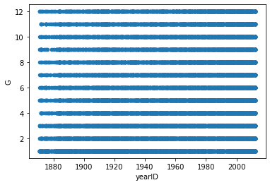
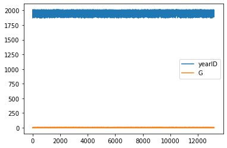

## We can use python to read SQL data from a local SQL server
### SQL works pretty much the same in jupyter notebooks with pyodbc as in normal SQL


```python
import pandas as pd
from pandas import DataFrame
import matplotlib.pyplot as plt
```


```python
import pyodbc
pyodbc.drivers()
```


    ['SQL Server',
     'SQL Server Native Client 11.0',
     'SQL Server Native Client RDA 11.0',
     'ODBC Driver 17 for SQL Server',
     'Microsoft Access Driver (*.mdb, *.accdb)',
     'Microsoft Excel Driver (*.xls, *.xlsx, *.xlsm, *.xlsb)',
     'Microsoft Access Text Driver (*.txt, *.csv)']


```python
SERVER = 'DESKTOP-M5GLJJM'
database = 'BaseballData'
cnxn = pyodbc.connect('DRIVER={SQL Server Native Client 11.0};SERVER='+SERVER+';DATABASE='+database+';Trusted_Connection=yes;')
```


```python
cursor = cnxn.cursor()
```

## Your typical Select from SQL clause:


```python
query = "SELECT playerID , yearID,teamID, G FROM [batting] where G < 13";
query
```


    'SELECT playerID , yearID,teamID, G FROM [batting] where G < 13'


## SQL query allocated to query variable


```python
df = pd.read_sql(query,cnxn)
```

### Pandas reads the SQL query and we can pass the query to a dataframe


```python
df.head()
```


<div>
<style scoped>
    .dataframe tbody tr th:only-of-type {
        vertical-align: middle;
    }

    .dataframe tbody tr th {
        vertical-align: top;
    }

    .dataframe thead th {
        text-align: right;
    }
</style>
<table border="1" class="dataframe">
  <thead>
    <tr style="text-align: right;">
      <th></th>
      <th>playerID</th>
      <th>yearID</th>
      <th>teamID</th>
      <th>G</th>
    </tr>
  </thead>
  <tbody>
    <tr>
      <th>0</th>
      <td>aardsda01</td>
      <td>2004</td>
      <td>SFN</td>
      <td>11</td>
    </tr>
    <tr>
      <th>1</th>
      <td>aardsda01</td>
      <td>2012</td>
      <td>NYA</td>
      <td>1</td>
    </tr>
    <tr>
      <th>2</th>
      <td>aaronto01</td>
      <td>1965</td>
      <td>ML1</td>
      <td>8</td>
    </tr>
    <tr>
      <th>3</th>
      <td>aasedo01</td>
      <td>1987</td>
      <td>BAL</td>
      <td>7</td>
    </tr>
    <tr>
      <th>4</th>
      <td>abadan01</td>
      <td>2001</td>
      <td>OAK</td>
      <td>1</td>
    </tr>
  </tbody>
</table>
</div>


### From here, we can edit the pandas dataframe as we normally would in python, and explore some typical pandas functions.


```python
df.count()
```


    playerID    24130
    yearID      24130
    teamID      24130
    G           24130
    dtype: int64


```python
df.describe()
```


<div>
<style scoped>
    .dataframe tbody tr th:only-of-type {
        vertical-align: middle;
    }

    .dataframe tbody tr th {
        vertical-align: top;
    }

    .dataframe thead th {
        text-align: right;
    }
</style>
<table border="1" class="dataframe">
  <thead>
    <tr style="text-align: right;">
      <th></th>
      <th>yearID</th>
      <th>G</th>
    </tr>
  </thead>
  <tbody>
    <tr>
      <th>count</th>
      <td>24130.000000</td>
      <td>24130.000000</td>
    </tr>
    <tr>
      <th>mean</th>
      <td>1956.266266</td>
      <td>5.475135</td>
    </tr>
    <tr>
      <th>std</th>
      <td>39.467915</td>
      <td>3.454059</td>
    </tr>
    <tr>
      <th>min</th>
      <td>1871.000000</td>
      <td>1.000000</td>
    </tr>
    <tr>
      <th>25%</th>
      <td>1922.000000</td>
      <td>2.000000</td>
    </tr>
    <tr>
      <th>50%</th>
      <td>1962.000000</td>
      <td>5.000000</td>
    </tr>
    <tr>
      <th>75%</th>
      <td>1992.000000</td>
      <td>8.000000</td>
    </tr>
    <tr>
      <th>max</th>
      <td>2012.000000</td>
      <td>12.000000</td>
    </tr>
  </tbody>
</table>
</div>


```python
df.tail()
```


<div>
<style scoped>
    .dataframe tbody tr th:only-of-type {
        vertical-align: middle;
    }

    .dataframe tbody tr th {
        vertical-align: top;
    }

    .dataframe thead th {
        text-align: right;
    }
</style>
<table border="1" class="dataframe">
  <thead>
    <tr style="text-align: right;">
      <th></th>
      <th>playerID</th>
      <th>yearID</th>
      <th>teamID</th>
      <th>G</th>
    </tr>
  </thead>
  <tbody>
    <tr>
      <th>24125</th>
      <td>zuvelpa01</td>
      <td>1984</td>
      <td>ATL</td>
      <td>11</td>
    </tr>
    <tr>
      <th>24126</th>
      <td>zuvelpa01</td>
      <td>1991</td>
      <td>KCA</td>
      <td>2</td>
    </tr>
    <tr>
      <th>24127</th>
      <td>zuverge01</td>
      <td>1952</td>
      <td>CLE</td>
      <td>2</td>
    </tr>
    <tr>
      <th>24128</th>
      <td>zuverge01</td>
      <td>1954</td>
      <td>CIN</td>
      <td>2</td>
    </tr>
    <tr>
      <th>24129</th>
      <td>zuverge01</td>
      <td>1959</td>
      <td>BAL</td>
      <td>6</td>
    </tr>
  </tbody>
</table>
</div>


```python
df.plot(kind = 'scatter',x='yearID' , y = 'G')
plt.show()
```


    

    


```python
query = "SELECT playerID , yearID,teamID, G FROM [batting] where G < 6";
query
```


    'SELECT playerID , yearID,teamID, G FROM [batting] where G < 6'


```python
df = pd.read_sql(query,cnxn)
```


```python
df.head()
```


<div>
<style scoped>
    .dataframe tbody tr th:only-of-type {
        vertical-align: middle;
    }

    .dataframe tbody tr th {
        vertical-align: top;
    }

    .dataframe thead th {
        text-align: right;
    }
</style>
<table border="1" class="dataframe">
  <thead>
    <tr style="text-align: right;">
      <th></th>
      <th>playerID</th>
      <th>yearID</th>
      <th>teamID</th>
      <th>G</th>
    </tr>
  </thead>
  <tbody>
    <tr>
      <th>0</th>
      <td>aardsda01</td>
      <td>2012</td>
      <td>NYA</td>
      <td>1</td>
    </tr>
    <tr>
      <th>1</th>
      <td>abadan01</td>
      <td>2001</td>
      <td>OAK</td>
      <td>1</td>
    </tr>
    <tr>
      <th>2</th>
      <td>abadan01</td>
      <td>2006</td>
      <td>CIN</td>
      <td>5</td>
    </tr>
    <tr>
      <th>3</th>
      <td>abadijo01</td>
      <td>1875</td>
      <td>BR2</td>
      <td>1</td>
    </tr>
    <tr>
      <th>4</th>
      <td>abbated01</td>
      <td>1897</td>
      <td>PHI</td>
      <td>3</td>
    </tr>
  </tbody>
</table>
</div>


```python
year = df[['yearID','G']]
year.plot()
```


    <AxesSubplot:>


    

    


```python
year.describe()
```


<div>
<style scoped>
    .dataframe tbody tr th:only-of-type {
        vertical-align: middle;
    }

    .dataframe tbody tr th {
        vertical-align: top;
    }

    .dataframe thead th {
        text-align: right;
    }
</style>
<table border="1" class="dataframe">
  <thead>
    <tr style="text-align: right;">
      <th></th>
      <th>yearID</th>
      <th>G</th>
    </tr>
  </thead>
  <tbody>
    <tr>
      <th>count</th>
      <td>13181.000000</td>
      <td>13181.000000</td>
    </tr>
    <tr>
      <th>mean</th>
      <td>1950.478188</td>
      <td>2.737804</td>
    </tr>
    <tr>
      <th>std</th>
      <td>40.121368</td>
      <td>1.415121</td>
    </tr>
    <tr>
      <th>min</th>
      <td>1871.000000</td>
      <td>1.000000</td>
    </tr>
    <tr>
      <th>25%</th>
      <td>1915.000000</td>
      <td>1.000000</td>
    </tr>
    <tr>
      <th>50%</th>
      <td>1951.000000</td>
      <td>3.000000</td>
    </tr>
    <tr>
      <th>75%</th>
      <td>1988.000000</td>
      <td>4.000000</td>
    </tr>
    <tr>
      <th>max</th>
      <td>2012.000000</td>
      <td>5.000000</td>
    </tr>
  </tbody>
</table>
</div>


```python

```
