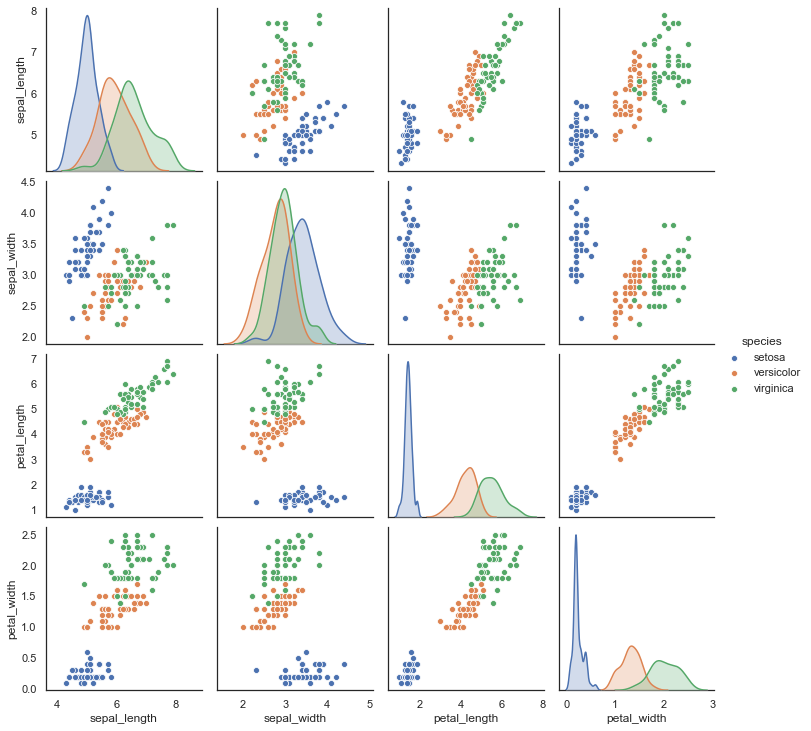
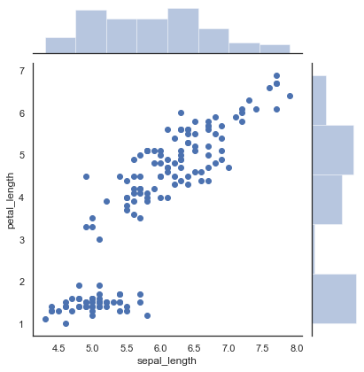
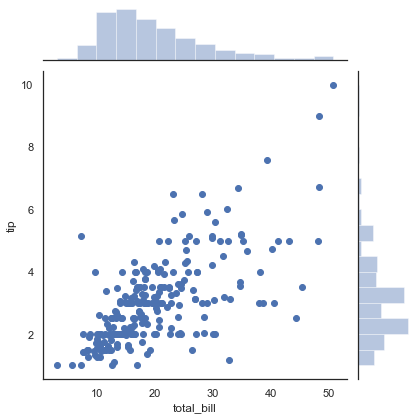
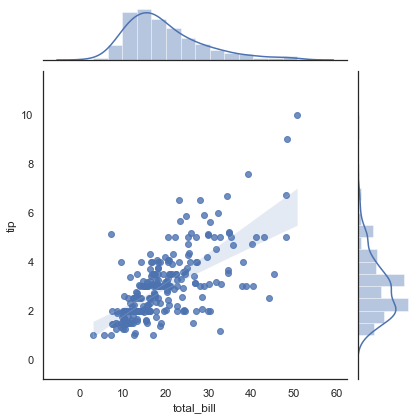

Python Seaborn is a visualization library based on python's matplotlib. Seaborn is a high-level interface which allows users to create attractive statistical graphics.

Seaborn also has a number of free datasets built in.


```python
import numpy as np
import pandas as pd
import matplotlib.pyplot as plt
import seaborn as sns
import warnings
warnings.filterwarnings('ignore')
```

Seaborn has a number of datasets that are built-in.

Datasets just need to be loaded, below is a list:


```python
sns.get_dataset_names()
```


    ['anagrams',
     'anscombe',
     'attention',
     'brain_networks',
     'car_crashes',
     'diamonds',
     'dots',
     'exercise',
     'flights',
     'fmri',
     'gammas',
     'geyser',
     'iris',
     'mpg',
     'penguins',
     'planets',
     'tips',
     'titanic']


```python
iris = sns.load_dataset("iris")
sns.pairplot(iris, hue="species");
```





```python
sns.jointplot(x="sepal_length", y="petal_length", data=iris);
```





```python
tips = sns.load_dataset("tips")
import numpy as np, pandas as pd; np.random.seed(0)
import seaborn as sns; sns.set(style="white", color_codes=True)
g = sns.jointplot(x="total_bill", y="tip", data=tips)
```





```python
g = sns.jointplot("total_bill", "tip", data=tips, kind="reg")
```





```python

```

