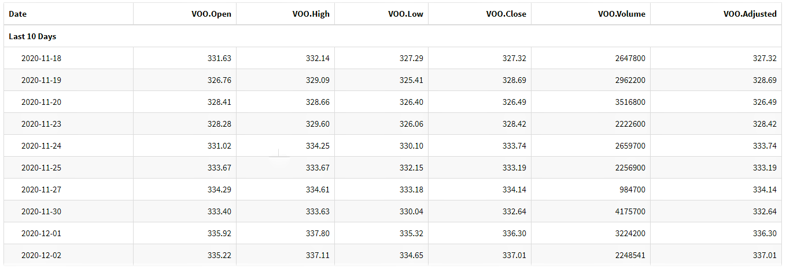
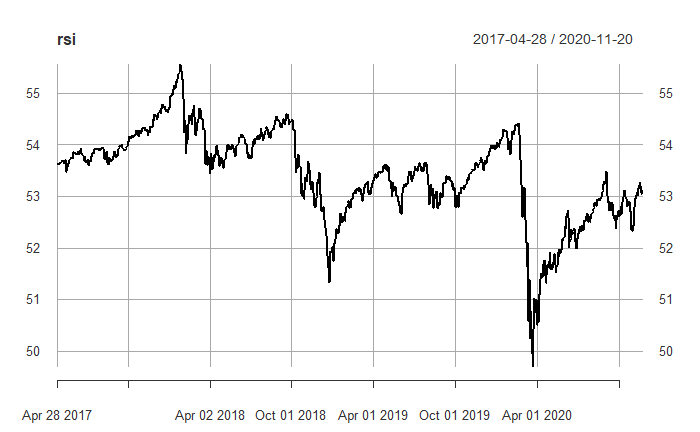
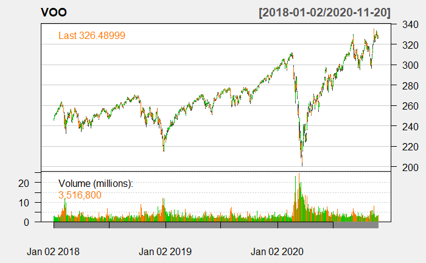
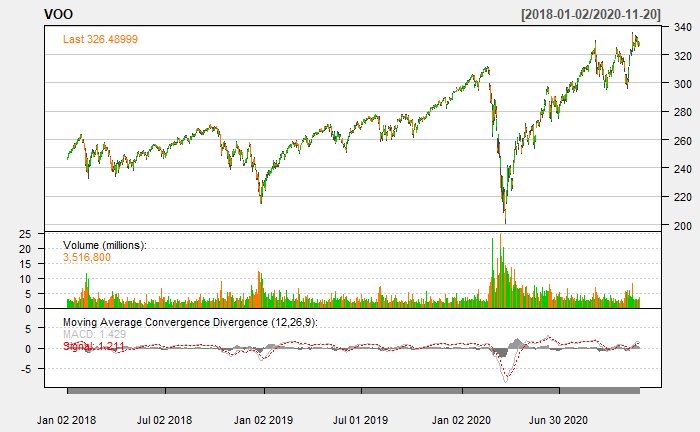

R has the capability of getting OHLC ("Open", "High", "Low", "Close") financial data, quite easily, through the "getsymbols" function.


# R Plots and Data Frames

Lets look at the ticker: VOO, and get some data and a few plots to observe.


```r 
knitr::opts_chunk$set(echo = TRUE)
knitr::opts_chunk$set(message = FALSE)
knitr::opts_chunk$set(warning=FALSE, message=FALSE)
options("getSymbols.warning4.0"=FALSE)
options(comment = NULL)

library(quantmod)
library(xts)
library(tidyverse)
library(stringr)
library(lubridate)
library(plotly)
library(PerformanceAnalytics)
library(kableExtra)
library(dygraphs)
library(TTR)
tags: ["R","Visualisation"]
```

```r
a<- Sys.Date()

b <- year(a)

getSymbols("VOO",n = 400)

VO <- data.frame(Date=index(VOO),coredata(VOO))

VO<-tail(VO,10)
 
VO <- data.frame(VO,row.names=NULL)

kable(VO)%>%
  kable_styling(c("striped", "bordered"))%>%
  pack_rows("Last 10 Days", 1, 10, label_row_css = "background-color: white; color: black;")

```

```r
bbands <- BBands(VOO[,c("VOO.High","VOO.Low","VOO.Close")])


vo<-tail(VOO,10)
 

macd <- MACD(Cl(VOO), nFast=12, nSlow=26,
             nSig=9, maType=SMA)
macd<-tail(macd,n=900)

rsi = RSI(Cl(VOO), n=900)
rsi<-tail(rsi,n=900)

plot(rsi,type='l')
```

```r
macd <- MACD(Cl(VOO), nFast=12, nSlow=26,
             nSig=9, maType=SMA)
macd<-tail(macd,n=900)


chartSeries(VOO,
            subset='2018::2020',
            theme=chartTheme('white'))
addMACD(fast=12,slow=26,signal=9,type="EMA")
```





 


