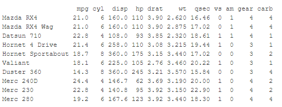
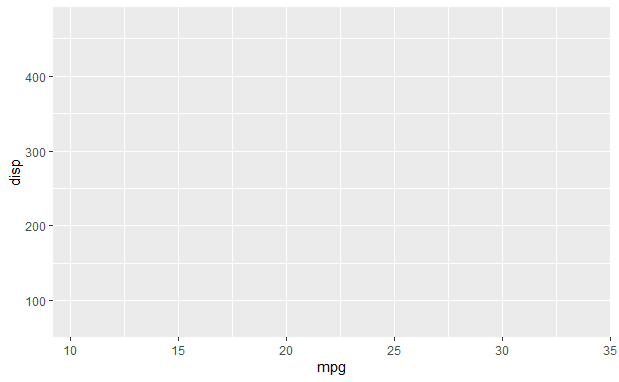
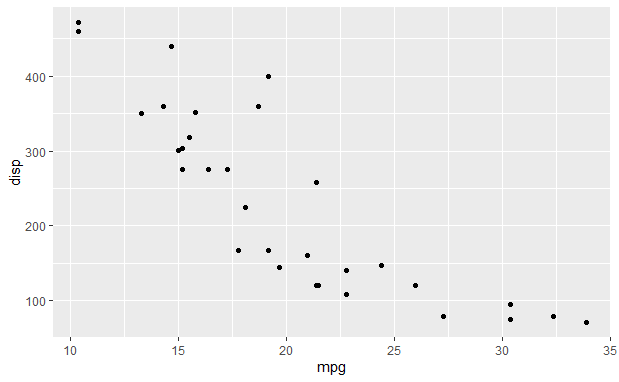
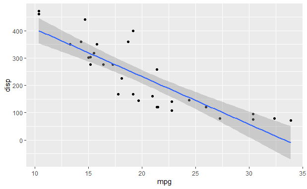
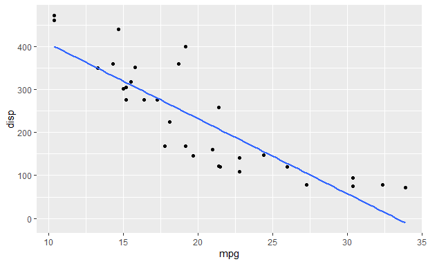
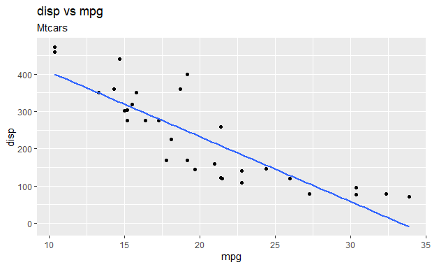

R Programming is a popular open source programming language, used in statistical computing and graphics. The R software environment is written primarily in C, Fortran, and R.  Ross Ihaka and Robert Gentleman from Auckland University started R 1993.

ggplot is a data visualization package for R which was created by Hadley Wickham in 2005.

```r
library(ggplot2)
data ("mtcars")
head(mtcars,10)

```

Getting some data and calling the ggplot2 library



```r
mpg= mtcars$mpg
disp= mtcars$disp

p = ggplot(mtcars, aes(x=mpg, y=disp))

p
```



Getting the basic ggplot and assigning it to the variable p

```r
p+ geom_point()
```



Adding a scatterplot!

```r
p+ geom_point()+ geom_smooth(method="lm")
```



SE = FALSE will turn off the confidence intervals

```r
p1 = p+ geom_point()+ geom_smooth(method="lm",se=FALSE)
p1


```



Assign this all to p1


Adding some titles

```r
p1+ ggtitle("disp vs mpg", subtitle="Mtcars") 
```





