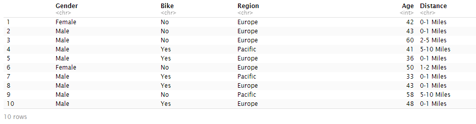
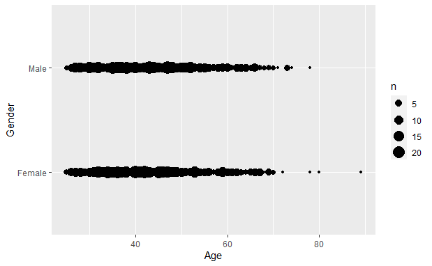
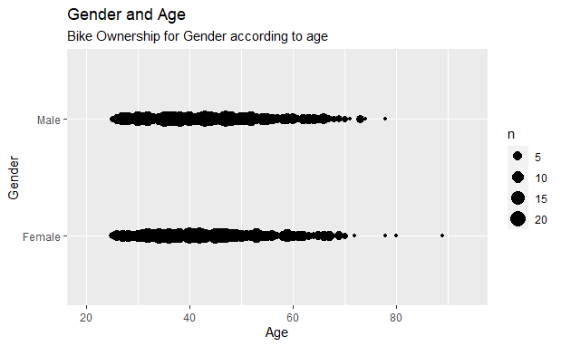

I took some data from my computer, "Bike buyers" and decided to take the columns that I wanted to get some visuals on.

ggplot has a number of different ways of displaying data as displayed below.

```r
bikeb <- read.csv("C:/Data/bike_buyers.csv")

names(bikeb)
```


```r
bike<-data.frame(Gender = bikeb$Gender, 
               Bike = bikeb$Purchased.Bike,
               Region = bikeb$Region,
               Age = bikeb$Age,
               Distance = bikeb$Commute.Distance)

str(bike)
head(bike,10)
```



```r
library(ggplot2)
p <- ggplot(bike, aes(x=Age, y=Gender)) +geom_count()

p
```



```r
mn<-min(bike$Age)-5
mn

mx<-max(bike$Age)+5
mx
```

```r
p + xlim(c(mn, mx))+ ggtitle("Gender and Age", subtitle="Bike Ownership for Gender according to age")
```



