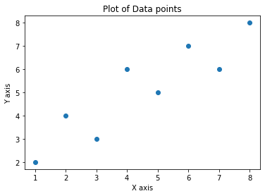
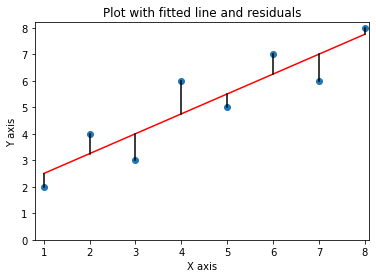

# Linear Regression Using ordinary least squares


```python
import numpy as np
import pandas as pd
import matplotlib.pyplot as plt
import seaborn as sns
from sklearn.linear_model import LinearRegression
import statsmodels.formula.api as st
from scipy import stats
from pylab import *
```


```python

data = {'x' : pd.Series([1, 2, 3,4,5,6,7,8], index=[1, 2, 3,4,5,6,7,8]),
       'y' : pd.Series([2,4,3,6,5,7,6,8], index=[1, 2, 3,4,5,6,7,8])}

df = pd.DataFrame(data)
df
```


<div>
<style scoped>
    .dataframe tbody tr th:only-of-type {
        vertical-align: middle;
    }

    .dataframe tbody tr th {
        vertical-align: top;
    }

    .dataframe thead th {
        text-align: right;
    }
</style>
<table border="1" class="dataframe">
  <thead>
    <tr style="text-align: right;">
      <th></th>
      <th>x</th>
      <th>y</th>
    </tr>
  </thead>
  <tbody>
    <tr>
      <th>1</th>
      <td>1</td>
      <td>2</td>
    </tr>
    <tr>
      <th>2</th>
      <td>2</td>
      <td>4</td>
    </tr>
    <tr>
      <th>3</th>
      <td>3</td>
      <td>3</td>
    </tr>
    <tr>
      <th>4</th>
      <td>4</td>
      <td>6</td>
    </tr>
    <tr>
      <th>5</th>
      <td>5</td>
      <td>5</td>
    </tr>
    <tr>
      <th>6</th>
      <td>6</td>
      <td>7</td>
    </tr>
    <tr>
      <th>7</th>
      <td>7</td>
      <td>6</td>
    </tr>
    <tr>
      <th>8</th>
      <td>8</td>
      <td>8</td>
    </tr>
  </tbody>
</table>
</div>


```python
X = df['x']
X
```


    1    1
    2    2
    3    3
    4    4
    5    5
    6    6
    7    7
    8    8
    Name: x, dtype: int64


```python
Y = df['y']
Y
```


    1    2
    2    4
    3    3
    4    6
    5    5
    6    7
    7    6
    8    8
    Name: y, dtype: int64


```python
plt.scatter(X,Y)
plt.title('Plot of Data points')
plt.xlabel('X axis')
plt.ylabel('Y axis')
plt.show()
```


    

    


## We have the same set of plot points as previously observed in the [Least Squares linear regression](https://nbviewer.jupyter.org/github/NicJC/wyrfraym/blob/27252ec121af5c91fa578e45f3ec3ed721744e05/content/posts/ML%20LSE/Least%20Squares%20linear%20regression.ipynb)

Here we are going to work out the best fit line, but we are going to approach the calculation from the Ordinary Least Squares method.

We will use the equation : 
    $$\hat y = \beta_0 + \beta_i x$$

#### By using Ordinary least squares regression, we can find the best fitting line by minimizing the squared errors.
 
OLS minimizes the sum of the squared vertical distances - the residuals as shown in the plot below.


```python
x = np.array([1,2,3,4,5,6,7,8])
y = np.array([2,4,3,6,5,7,6,8])

k,d = polyfit(x,y,1)
yfit = k*x+d

scatter(x,y)

plot(x, yfit, 'r')
for j in range(len(x)):
    plot([x[j], x[j]], [yfit[j], y[j]], 'k')
xlim((0.8, 8.1))
ylim((0, 8.2))
xlabel('X axis')
ylabel('Y axis')
title('Plot with fitted line and residuals')

show()
```


    

    


$$\hat y = \beta_0 + \beta_i x $$

$\hat y$ is the predicted value of $y$ for a given $x$ value.

$x_i$ is the value of the $ith$ independent variable.  

$y_i$ is the observed value of the dependent valiable for the $ith$ observation.
    
$\bar x$ is the mean of $x$ values.  

$\bar y$ is the mean of $y$ values
  
$\beta_0$ is the intercept where the line croses the $y$ intercept.


```python
xbar = np.mean(X)
xbar
```


    4.5


```python
ybar = np.mean(Y)
ybar
```


    5.125


$b_1$ is the slope of the fitted line.

$b_1 = \frac{\sum (x_i - \bar x)(y_i - \bar y)}{\sum (x_i - \bar x)^{2}}$, which can be worked out by hand as below:


```python
data = {"X"                    :['1', '2', '3','4','5','6','7','8'],
       "Y"                     :['2','4','3','6','5','7','6','8'],
        "X-xbar"               :['-3.5','-2.5','-1.5','-0.5','0.5','1.5','2.5','3.5'],
        "Y-ybar"               :['-3.125','-1.125','-2.125','0.875','-0.125','1.875','0.875','2.875'],
        "  X-xbar)x(Y-ybar)  " :['10.9375','2.8125','3.1875','-0.4375','-0.0625','2.8125','2.1875','10.0625'],
        "(X-xbar)^2"           :['12.25','6.25','2.25','0.25','0.25','2.25','6.25','12.25']}

df = pd.DataFrame(data,index=['X1', 'X2', 'X3','X4','X5','X6','X7','X8'])
print(df)
```

        X  Y X-xbar  Y-ybar   X-xbar)x(Y-ybar)   (X-xbar)^2
    X1  1  2   -3.5  -3.125              10.9375      12.25
    X2  2  4   -2.5  -1.125               2.8125       6.25
    X3  3  3   -1.5  -2.125               3.1875       2.25
    X4  4  6   -0.5   0.875              -0.4375       0.25
    X5  5  5    0.5  -0.125              -0.0625       0.25
    X6  6  7    1.5   1.875               2.8125       2.25
    X7  7  6    2.5   0.875               2.1875       6.25
    X8  8  8    3.5   2.875              10.0625      12.25
    

By taking the formula: $\sum(x_i-\bar x)\times(y_i-\bar y) = 31.5$, and $\sum(x_1 - \bar x)^{2} = 42$, we can get the slope of the line by dividing 31.5 by 42.


```python
slope = 31.5 / 42
slope
```


    0.75


The y intercept: $b_0 = \bar y - b_1 \bar x$

### By substitutuion: 


```python
intercept = ybar - (slope * xbar)
intercept
```


    1.75


## We can verify the results of the above by using some popular libraries:


```python
data = {'x' : pd.Series([1, 2, 3,4,5,6,7,8], index=[1, 2, 3,4,5,6,7,8]),
       'y' : pd.Series([2,4,3,6,5,7,6,8], index=[1, 2, 3,4,5,6,7,8])}

df = pd.DataFrame(data)
df
```


<div>
<style scoped>
    .dataframe tbody tr th:only-of-type {
        vertical-align: middle;
    }

    .dataframe tbody tr th {
        vertical-align: top;
    }

    .dataframe thead th {
        text-align: right;
    }
</style>
<table border="1" class="dataframe">
  <thead>
    <tr style="text-align: right;">
      <th></th>
      <th>x</th>
      <th>y</th>
    </tr>
  </thead>
  <tbody>
    <tr>
      <th>1</th>
      <td>1</td>
      <td>2</td>
    </tr>
    <tr>
      <th>2</th>
      <td>2</td>
      <td>4</td>
    </tr>
    <tr>
      <th>3</th>
      <td>3</td>
      <td>3</td>
    </tr>
    <tr>
      <th>4</th>
      <td>4</td>
      <td>6</td>
    </tr>
    <tr>
      <th>5</th>
      <td>5</td>
      <td>5</td>
    </tr>
    <tr>
      <th>6</th>
      <td>6</td>
      <td>7</td>
    </tr>
    <tr>
      <th>7</th>
      <td>7</td>
      <td>6</td>
    </tr>
    <tr>
      <th>8</th>
      <td>8</td>
      <td>8</td>
    </tr>
  </tbody>
</table>
</div>


```python
model = st.ols('Y ~ X', df)
model = model.fit()
```


```python
model.params
```


    Intercept    1.75
    X            0.75
    dtype: float64


```python
slope, intercept, r, p, std_err = stats.linregress(x, y)

print(slope)
```

    0.75
    


```python
print(intercept)
```

    1.75
    


```python

```
